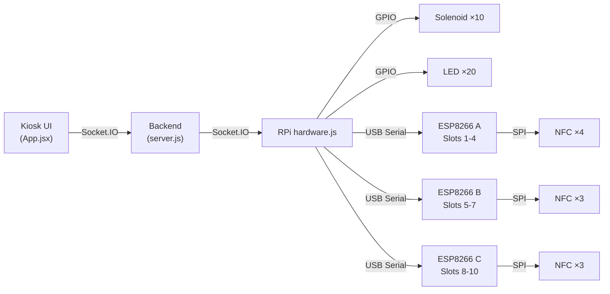
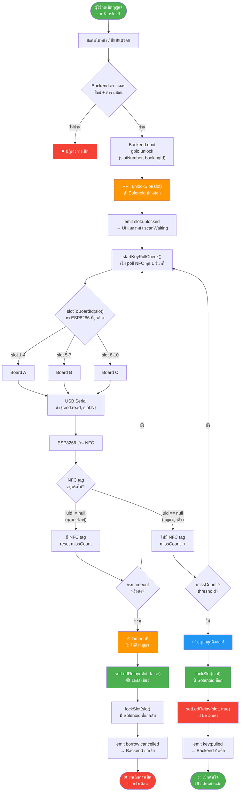
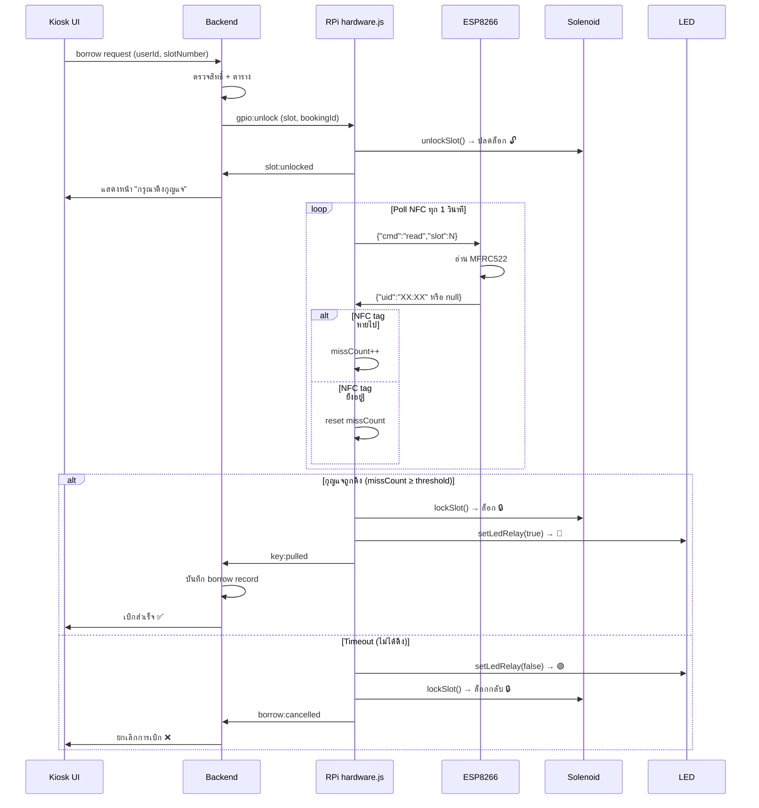

# Flow การเบิกกุญแจ — Flowchart

## System Overview

```mermaid
graph LR
    UI["Kiosk UI<br/>(App.jsx)"] -->|Socket.IO| BE["Backend<br/>(server.js)"]
    BE -->|Socket.IO| HW["RPi hardware.js"]
    HW -->|GPIO| SOL["Solenoid ×10"]
    HW -->|GPIO| LED["LED ×20"]
    HW -->|USB Serial| EA["ESP8266 A<br/>Slots 1-4"]
    HW -->|USB Serial| EB["ESP8266 B<br/>Slots 5-7"]
    HW -->|USB Serial| EC["ESP8266 C<br/>Slots 8-10"]
    EA -->|SPI| NFC1["NFC ×4"]
    EB -->|SPI| NFC2["NFC ×3"]
    EC -->|SPI| NFC3["NFC ×3"]
```

## Flow การเบิกกุญแจ

```mermaid
flowchart TD
    START(["ผู้ใช้กดเบิกกุญแจ<br/>บน Kiosk UI"]) --> SCAN["สแกนใบหน้า / ยืนยันตัวตน"]
    SCAN --> BE_CHECK{"Backend ตรวจสอบ<br/>สิทธิ์ + ตารางสอน"}
    BE_CHECK -->|ไม่ผ่าน| DENIED["❌ ปฏิเสธการเบิก"]
    BE_CHECK -->|ผ่าน| EMIT_UNLOCK["Backend emit<br/>gpio:unlock<br/>(slotNumber, bookingId)"]

    EMIT_UNLOCK --> UNLOCK["RPi: unlockSlot(slot)<br/>🔓 Solenoid ปลดล็อก"]
    UNLOCK --> EMIT_UNLOCKED["emit slot:unlocked<br/>→ UI แสดงหน้า scanWaiting"]
    EMIT_UNLOCKED --> START_CHECK["startKeyPullCheck()<br/>เริ่ม poll NFC ทุก 1 วินาที"]

    START_CHECK --> ROUTE{"slotToBoardId(slot)<br/>หา ESP8266 ที่ถูกต้อง"}
    ROUTE -->|"slot 1-4"| BOARD_A["Board A"]
    ROUTE -->|"slot 5-7"| BOARD_B["Board B"]
    ROUTE -->|"slot 8-10"| BOARD_C["Board C"]

    BOARD_A --> SEND_CMD
    BOARD_B --> SEND_CMD
    BOARD_C --> SEND_CMD

    SEND_CMD["USB Serial<br/>ส่ง {cmd:read, slot:N}"] --> ESP_READ["ESP8266 อ่าน NFC"]

    ESP_READ --> ESP_RESP{"NFC tag<br/>อยู่หรือไม่?"}

    ESP_RESP -->|"uid != null<br/>(กุญแจยังอยู่)"| HAS_TAG["มี NFC tag<br/>reset missCount"]
    ESP_RESP -->|"uid == null<br/>(กุญแจถูกดึง)"| NO_TAG["ไม่มี NFC tag<br/>missCount++"]

    HAS_TAG --> TIMEOUT_CHECK{"ครบ timeout<br/>หรือยัง?"}
    TIMEOUT_CHECK -->|ยัง| START_CHECK
    TIMEOUT_CHECK -->|ครบ| CANCELLED["⏰ Timeout!<br/>ไม่ได้ดึงกุญแจ"]

    NO_TAG --> MISS_CHECK{"missCount ≥<br/>threshold?"}
    MISS_CHECK -->|ยัง| START_CHECK
    MISS_CHECK -->|ใช่| PULLED["✅ กุญแจถูกดึงออก!"]

    PULLED --> LOCK_OK["lockSlot(slot)<br/>🔒 Solenoid ล็อก"]
    LOCK_OK --> LED_RED["setLedRelay(slot, true)<br/>🔴 LED แดง"]
    LED_RED --> EMIT_PULLED["emit key:pulled<br/>→ Backend บันทึก"]
    EMIT_PULLED --> SUCCESS(["✅ เบิกสำเร็จ<br/>UI กลับหน้าหลัก"])

    CANCELLED --> LED_GREEN["setLedRelay(slot, false)<br/>🟢 LED เขียว"]
    LED_GREEN --> LOCK_CANCEL["lockSlot(slot)<br/>🔒 Solenoid ล็อกกลับ"]
    LOCK_CANCEL --> EMIT_CANCEL["emit borrow:cancelled<br/>→ Backend ยกเลิก"]
    EMIT_CANCEL --> FAIL(["❌ ยกเลิกการเบิก<br/>UI แจ้งเตือน"])

    style START fill:#4CAF50,color:#fff
    style SUCCESS fill:#4CAF50,color:#fff
    style FAIL fill:#f44336,color:#fff
    style DENIED fill:#f44336,color:#fff
    style PULLED fill:#2196F3,color:#fff
    style CANCELLED fill:#FF9800,color:#fff
    style UNLOCK fill:#FF9800,color:#fff
    style LOCK_OK fill:#4CAF50,color:#fff
    style LED_RED fill:#f44336,color:#fff
    style LED_GREEN fill:#4CAF50,color:#fff
```

## Sequence Diagram

```mermaid
sequenceDiagram
    participant U as Kiosk UI
    participant B as Backend
    participant H as RPi hardware.js
    participant E as ESP8266
    participant S as Solenoid
    participant L as LED

    U->>B: borrow request (userId, slotNumber)
    B->>B: ตรวจสิทธิ์ + ตาราง
    B->>H: gpio:unlock (slot, bookingId)

    H->>S: unlockSlot() → ปลดล็อก 🔓
    H->>B: slot:unlocked
    B->>U: แสดงหน้า "กรุณาดึงกุญแจ"

    loop Poll NFC ทุก 1 วินาที
        H->>E: {"cmd":"read","slot":N}
        E->>E: อ่าน MFRC522
        E->>H: {"uid":"XX:XX" หรือ null}

        alt NFC tag หายไป
            H->>H: missCount++
        else NFC tag ยังอยู่
            H->>H: reset missCount
        end
    end

    alt กุญแจถูกดึง (missCount ≥ threshold)
        H->>S: lockSlot() → ล็อก 🔒
        H->>L: setLedRelay(true) → 🔴
        H->>B: key:pulled
        B->>B: บันทึก borrow record
        B->>U: เบิกสำเร็จ ✅
    else Timeout (ไม่ได้ดึง)
        H->>L: setLedRelay(false) → 🟢
        H->>S: lockSlot() → ล็อกกลับ 🔒
        H->>B: borrow:cancelled
        B->>U: ยกเลิกการเบิก ❌
    end
```
