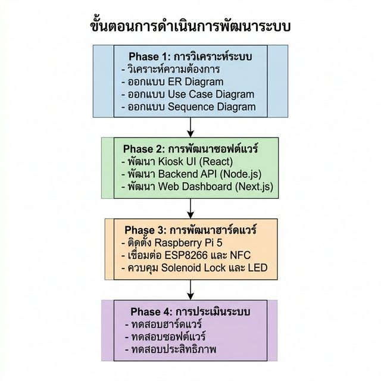

# บทที่ 3
# วิธีการดำเนินงาน

จากทฤษฎีที่เกี่ยวข้องที่กล่าวมาในบทที่ 2 เป็นทฤษฎีพื้นฐานที่ใช้ในการออกแบบและ
พัฒนาระบบจัดเก็บกุญแจอัตโนมัติ (Key Management System: KMS) การดำเนินงานครั้งนี้
ผู้วิจัยได้ใช้แนวทางการพัฒนาซอฟต์แวร์แบบ Agile โดยแบ่งขั้นตอนการพัฒนาออกเป็น 4
Phase ดังนี้ Phase 1 การวิเคราะห์ระบบ Phase 2 การพัฒนาซอฟต์แวร์ Phase 3 การพัฒนา
ฮาร์ดแวร์ และ Phase 4 การประเมินระบบ โดยมีขั้นตอนการดำเนินงานดังภาพที่ 3-1

> **ภาพที่ 3-1** แสดงขั้นตอนการดำเนินการพัฒนาระบบจัดเก็บกุญแจอัตโนมัติ ประกอบไปด้วย
> 4 Phase ตามแนวทาง Agile ได้แก่ Phase 1 การวิเคราะห์ระบบ Phase 2 การพัฒนาซอฟต์แวร์
> Phase 3 การพัฒนาฮาร์ดแวร์ และ Phase 4 การประเมินระบบ

---

## 3.1 Phase 1: การวิเคราะห์ระบบ

การวิเคราะห์ระบบเป็นขั้นตอนแรกซึ่งมีความสำคัญอย่างยิ่งในกระบวนการพัฒนาซอฟต์แวร์
ในขั้นตอนนี้ผู้วิจัยได้ทำการวิเคราะห์และออกแบบระบบในทุกด้าน ไม่ว่าจะเป็นการออกแบบ
ฐานข้อมูล การกำหนดขอบเขตการใช้งานของผู้ใช้แต่ละบทบาท และการวางแผนลำดับขั้นตอน
การทำงานของทุกฟังก์ชัน เพื่อให้ระบบสามารถตอบสนองความต้องการของผู้ใช้งานได้อย่าง
ครบถ้วน ระบบ KMS ได้รับการออกแบบสำหรับผู้ใช้งาน 3 กลุ่มหลัก ได้แก่ นักศึกษา อาจารย์
หรือเจ้าหน้าที่ และผู้ดูแลระบบ (Admin)

### 3.1.1 การออกแบบ Entity Relationship Diagram

การออกแบบฐานข้อมูลเป็นรากฐานสำคัญของระบบ ผู้วิจัยได้จัดทำ Entity Relationship
Diagram (ERD) เพื่อแสดงโครงสร้างและความสัมพันธ์ระหว่างข้อมูลในระบบทั้งหมด
ดังภาพที่ 3-2

> **หมายเหตุ**: ภาพ ERD Diagram อ้างอิงจากไฟล์ [`phase1/er_diagram.md`](./phase1/er_diagram.md)

**ภาพที่ 3-2** แสดง Entity Relationship Diagram ของระบบ KMS ซึ่งประกอบไปด้วย
Entity หลักทั้งหมด 11 ตาราง ได้แก่ USER เป็นตารางที่เก็บข้อมูลผู้ใช้งานทุกประเภทในระบบ
ไม่ว่าจะเป็นนักศึกษา อาจารย์ หรือเจ้าหน้าที่ ประกอบด้วยข้อมูลรหัสนักศึกษา อีเมล รหัสผ่าน
บทบาทในระบบ (role) คะแนนพฤติกรรม (score) และสถานะการระงับบัญชี (isBanned)
KEY เป็นตารางที่เก็บข้อมูลกุญแจแต่ละดอก ประกอบด้วยรหัสห้อง (roomCode) หมายเลขช่อง
(slotNumber) และ UID ของ NFC Tag ที่ติดไว้บนกุญแจแต่ละดอก BOOKING เป็นตารางที่
บันทึกรายการเบิกคืนกุญแจทุกครั้ง ประกอบด้วยเวลาเบิก เวลาครบกำหนดคืน เวลาคืนจริง
สถานะ เหตุผล และคะแนนที่ถูกหักในกรณีที่คืนช้า DAILY_AUTHORIZATION เป็นตารางที่
ทำหน้าที่เป็น "ต้นฉบับความจริง" ในการตรวจสอบสิทธิ์เบิกกุญแจของผู้ใช้แต่ละรายในแต่ละวัน
โดยระบบจะดึงข้อมูลจากตาราง SCHEDULE มาสร้างรายการ DailyAuthorization ทุกเช้าโดยอัตโนมัติ
SCHEDULE เป็นตารางที่จัดเก็บตารางสอนประจำสัปดาห์ ระบุวิชา ห้อง วันสอน
และช่วงเวลาสอน SUBJECT เป็นตารางที่จัดเก็บรายชื่อวิชาเรียน PENALTY_LOG เป็น
ตารางที่บันทึกประวัติการหักคะแนนเมื่อผู้ใช้คืนกุญแจล่าช้า SYSTEM_LOG เป็นตาราง
บันทึกการกระทำทุกอย่างในระบบ SECTION และ MAJOR เป็นตารางที่เก็บข้อมูลกลุ่ม
เรียนและสาขาวิชา BORROW_REASON เป็นตารางที่กำหนดเหตุผลที่อนุญาตให้เบิกนอก
ตาราง และ PENALTY_CONFIG เป็นตารางการตั้งค่าระบบหักคะแนน

ความสัมพันธ์ที่สำคัญของระบบ ได้แก่ ความสัมพันธ์ระหว่าง SCHEDULE กับ
DAILY_AUTHORIZATION กล่าวคือ ตารางสอนประจำสัปดาห์จะถูกแปลงเป็น
DailyAuthorization ทุกเช้าของวันนั้น และความสัมพันธ์ระหว่าง BOOKING กับ
PENALTY_LOG กล่าวคือ ทุกครั้งที่มีการคืนกุญแจช้า ระบบจะสร้างบันทึกการหักคะแนน
โดยอัตโนมัติ

### 3.1.2 การออกแบบ Use Case Diagram

ผู้วิจัยได้จัดทำ Use Case Diagram เพื่อแสดงขอบเขตความสามารถของระบบที่แต่ละบทบาทผู้ใช้
สามารถเข้าถึงได้ ดังภาพที่ 3-3

> **หมายเหตุ**: ภาพ Use Case Diagram อ้างอิงจากไฟล์ [`phase1/usecase_diagram.md`](./phase1/usecase_diagram.md)

**ภาพที่ 3-3** แสดง Use Case Diagram ของระบบ KMS ซึ่งประกอบไปด้วยผู้ใช้งาน 3 กลุ่ม
ได้แก่ นักศึกษา อาจารย์หรือเจ้าหน้าที่ และผู้ดูแลระบบ โดยมีรายละเอียดสิทธิ์การใช้งาน
ดังต่อไปนี้

นักศึกษาสามารถเบิกกุญแจได้ตามตารางเรียนโดยไม่ต้องระบุเหตุผล หรือเบิกนอกตาราง
โดยต้องระบุเหตุผลก่อนทำรายการ สามารถคืนกุญแจ สลับสิทธิ์กุญแจกับผู้ใช้งานอื่น และ
ตรวจสอบประวัติการเบิกคืนของตนเองได้ อาจารย์หรือเจ้าหน้าที่มีสิทธิ์เบิกกุญแจได้
ทันทีโดยไม่ต้องระบุเหตุผล สามารถโอนสิทธิ์กุญแจให้ผู้อื่น ตรวจสอบประวัติ และอนุมัติ
การเบิกกรณีพิเศษได้ อาจารย์ยังสามารถจัดการตารางสอนของตนเองผ่านระบบเว็บ
ได้อีกด้วย ผู้ดูแลระบบมีสิทธิ์สูงสุด ครอบคลุมทุกฟังก์ชันในระบบ ทั้งการจัดการข้อมูล
ผู้ใช้ การจัดการกุญแจ การกำหนดตารางเรียน และการดู System Log

### 3.1.3 การออกแบบ Sequence Diagram

ผู้วิจัยได้จัดทำ Sequence Diagram สำหรับฟังก์ชันหลักของระบบทั้งหมด 5 ฟังก์ชัน ได้แก่
การเบิกกุญแจ การคืนกุญแจ การสลับสิทธิ์กุญแจ การโอนสิทธิ์กุญแจ และการทำงานของ
เจ้าหน้าที่และอาจารย์ผ่านระบบเว็บ

> **หมายเหตุ**: Sequence Diagrams ทั้งหมดอ้างอิงจากไฟล์ [`phase1/sequence_diagrams.md`](./phase1/sequence_diagrams.md)

**3.1.3.1 Sequence Diagram การเบิกกุญแจ** แสดงดังภาพที่ 3-4

**ภาพที่ 3-4** แสดง Sequence Diagram ของขั้นตอนการเบิกกุญแจ ซึ่งประกอบด้วยการ
ทำงานร่วมกันของ 4 ส่วน ได้แก่ Kiosk UI (React) Backend (Node.js) Hardware Service
(Raspberry Pi) และ ESP8266 Boards โดยมีขั้นตอนการทำงานดังนี้ ผู้ใช้กดปุ่ม "เบิกกุญแจ"
ระบบดึงรายชื่อห้องและสถานะกุญแจมาแสดง ผู้ใช้เลือกห้องที่ต้องการ จากนั้นวางบัตรหรือ
สแกนใบหน้าที่เครื่อง ZKTeco SmartAC1 ระบบ Backend รับข้อมูลผ่าน ADMS Protocol
และส่งข้อมูลผู้ใช้กลับมายัง Kiosk UI ผ่าน Socket Event ชื่อ scan:received ผู้ใช้กดยืนยัน
ระบบตรวจสอบสิทธิ์เบิกจากตาราง DailyAuthorization หากมีสิทธิ์ระบบจะสร้าง Booking
และส่งคำสั่ง gpio:unlock ไปยัง Hardware Service เพื่อปลดล็อก Solenoid ที่ช่องกุญแจที่
ระบุ Hardware Service รอตรวจจับการดึงกุญแจออกผ่าน NFC Polling สูงสุด 10 วินาที
หากไม่ดึงกุญแจออกภายในเวลาที่กำหนด ระบบจะล็อก Solenoid กลับและยกเลิก Booking
โดยอัตโนมัติ

**3.1.3.2 Sequence Diagram การคืนกุญแจ** แสดงดังภาพที่ 3-5

**ภาพที่ 3-5** แสดง Sequence Diagram ของขั้นตอนการคืนกุญแจ โดยผู้ใช้กดปุ่ม "คืนกุญแจ"
สแกนบัตรยืนยันตัวตน ระบบค้นหารายการเบิกที่ค้างอยู่ในฐานข้อมูล หากพบ ระบบจะแสดง
รายการเบิกพร้อมข้อมูลห้องและช่องกุญแจ ผู้ใช้กดยืนยัน ระบบเข้าสู่โหมดรอการตรวจจับ
NFC พร้อมนับถอยหลัง 60 วินาที เมื่อผู้ใช้เสียบกุญแจลงในช่อง ESP8266 จะตรวจจับ
NFC Tag และส่งสัญญาณกลับมายัง Backend ผ่าน Socket Event Hardware Service
ส่ง Event nfc:tag พร้อมหมายเลขช่องและ UID ไปยัง Kiosk UI ระบบตรวจสอบว่าช่อง
ตรงกับรายการเบิกหรือไม่ หากถูกต้องระบบจะปิดรายการเบิกและคำนวณ penalty กรณีคืน
ล่าช้า

**3.1.3.3 Sequence Diagram การสลับสิทธิ์กุญแจ** แสดงดังภาพที่ 3-6

**ภาพที่ 3-6** แสดง Sequence Diagram ของขั้นตอนการสลับสิทธิ์กุญแจ ฟังก์ชันนี้
ออกแบบสำหรับผู้ใช้ 2 คนที่ต้องการแลกเปลี่ยนสิทธิ์ห้องกันโดยไม่ต้องนำกุญแจมาคืน
ที่ตู้ก่อน ผู้ใช้คนที่ 1 สแกนบัตร ระบบดึงข้อมูลห้องที่ถืออยู่ ผู้ใช้คนที่ 2 สแกนบัตร
ระบบดึงข้อมูลห้องของผู้ใช้คนที่ 2 ระบบแสดงหน้ายืนยัน ผู้ใช้ยืนยัน ระบบตรวจสอบ
ว่าตารางเรียนไม่ทับซ้อนกัน จึงอนุญาตและดำเนินการสลับสิทธิ์ พร้อมบันทึกใน
SystemLog

**3.1.3.4 Sequence Diagram การโอนสิทธิ์กุญแจ** แสดงดังภาพที่ 3-7

**ภาพที่ 3-7** แสดง Sequence Diagram ของขั้นตอนการโอนสิทธิ์กุญแจ ฟังก์ชัน Transfer
ออกแบบสำหรับกรณีที่ผู้มีกุญแจต้องการมอบความรับผิดชอบให้ผู้อื่น โดยผู้โอนสแกนบัตร
ยืนยันตัวตน ผู้รับโอนสแกนบัตร ระบบแสดงข้อมูลทั้งสองฝ่ายพร้อมขอการยืนยัน หลังยืนยัน
ระบบเปลี่ยนชื่อผู้รับผิดชอบใน Booking ปัจจุบันเป็นผู้รับโอน และบันทึกประวัติในตาราง
SystemLog

**3.1.3.5 Sequence Diagram การทำงานของเจ้าหน้าที่และอาจารย์** แสดงดังภาพที่ 3-8

**ภาพที่ 3-8** แสดง Sequence Diagram ของขั้นตอนการทำงานของเจ้าหน้าที่และอาจารย์
ผ่านระบบเว็บ โดยผู้ใช้เข้าสู่ระบบด้วย username และ password ระบบตรวจสอบและ
ออก JWT Token กำหนดสิทธิ์ตามบทบาท อาจารย์สามารถจัดการตารางสอนของตนเอง
เจ้าหน้าที่และ Admin สามารถจัดการข้อมูลผู้ใช้ กุญแจ ตารางเรียน และดูประวัติการเบิก
คืนทั้งหมดในระบบ

---

## 3.2 Phase 2: การพัฒนาซอฟต์แวร์

การพัฒนาซอฟต์แวร์แบ่งออกเป็น 3 ส่วนหลัก ได้แก่ ระบบ Kiosk UI สำหรับตู้กุญแจ
ระบบ Backend Web Service และระบบ Web Dashboard สำหรับเจ้าหน้าที่และอาจารย์

### 3.2.1 ระบบ Kiosk UI (ตู้กุญแจ)

ระบบ Kiosk UI พัฒนาด้วย React และ Vite ทำงานบน Raspberry Pi 5 ที่เชื่อมต่อ
กับจอแสดงผลแบบ Touch Screen ใช้สถาปัตยกรรมแบบ State Machine ในไฟล์ App.jsx
เพื่อควบคุมการเปลี่ยนหน้าจออย่างเป็นระบบ โดยรับ Socket Events จาก Backend
และอัปเดตสถานะการแสดงผลตามลำดับ โครงสร้างของ Kiosk UI ประกอบด้วยหน้าต่างๆ
ดังนี้

หน้าหลัก (HomePage) ทำหน้าที่แสดงเมนูหลักของระบบ ประกอบด้วย ปุ่มเบิกกุญแจ
ปุ่มคืนกุญแจ ปุ่มสลับสิทธิ์ และปุ่มโอนสิทธิ์ หน้าเลือกห้อง (KeyListPage) ทำหน้าที่
ดึงรายชื่อห้องและสถานะกุญแจทั้งหมดจาก Backend แสดงผลแบบ Real-time โดยใช้
Socket.IO เพื่ออัปเดตสถานะทันทีเมื่อมีการเบิกหรือคืนกุญแจ หน้ารอสแกนบัตร
(ScanWaitingPage) ทำหน้าที่รอรับข้อมูลผู้ใช้จากเครื่อง ZKTeco SmartAC1 ผ่าน
Socket Event ชื่อ scan:received หน้ายืนยันตัวตน (ConfirmIdentityPage) ทำหน้าที่
แสดงรูปภาพและข้อมูลของผู้ใช้ที่สแกนมาได้เพื่อให้ผู้ใช้ยืนยันก่อนดำเนินการต่อ
หน้ากรอกเหตุผล (ReasonPage) ทำหน้าที่แสดงฟอร์มให้ผู้ใช้กรอกเหตุผลและระบุเวลา
คืนกุญแจสำหรับกรณีที่ไม่มีสิทธิ์ตามตาราง หน้ารอคืนกุญแจ (WaitForKeyReturnPage)
ทำหน้าที่รอรับสัญญาณ NFC จาก ESP8266 พร้อมนับถอยหลัง 60 วินาที หน้าสำเร็จ
(SuccessPage) ทำหน้าที่แสดงผลการดำเนินการสำเร็จพร้อมนับถอยหลัง 5 วินาที
ก่อนกลับสู่หน้าหลักโดยอัตโนมัติ หน้ายืนยันสลับสิทธิ์ (SwapConfirmPage) ทำหน้าที่
แสดงข้อมูลห้องของผู้ใช้ทั้ง 2 คนก่อนยืนยันการสลับ และหน้ายืนยันโอนสิทธิ์
(TransferConfirmPage) ทำหน้าที่แสดงข้อมูลผู้โอนและผู้รับก่อนยืนยันการโอน

### 3.2.2 ระบบ Backend Web Service

Backend พัฒนาด้วย Node.js และ Express.js ใช้ Prisma ORM สำหรับการจัดการ
ฐานข้อมูล PostgreSQL และใช้ Socket.IO สำหรับการสื่อสารแบบ Real-time ระหว่าง
Kiosk UI ระบบเว็บ และ Hardware Service โดยมี API Routes แบ่งออกเป็น 3 กลุ่มหลัก
ดังนี้

**กลุ่มที่ 1 API สำหรับ Kiosk และ Hardware** ทุก Route ในกลุ่มนี้ต้องใช้ HARDWARE_TOKEN
เพื่อยืนยันตัวตน ประกอบด้วย GET /api/hardware/keys สำหรับดึงรายชื่อกุญแจทั้งหมด
พร้อมสถานะ POST /api/hardware/identify สำหรับระบุตัวตนผู้ใช้จากข้อมูลที่เครื่อง ZKTeco
ส่งมา POST /api/hardware/borrow สำหรับทำรายการเบิกกุญแจพร้อมตรวจสิทธิ์จาก
ตารางเรียน POST /api/hardware/return สำหรับทำรายการคืนกุญแจพร้อมคำนวณ penalty
อัตโนมัติ POST /api/hardware/swap สำหรับสลับสิทธิ์กุญแจระหว่าง 2 ผู้ใช้ POST
/api/hardware/transfer สำหรับโอนสิทธิ์กุญแจจากผู้โอนไปผู้รับ และ POST
/api/hardware/move สำหรับย้ายสิทธิ์ห้อง

**กลุ่มที่ 2 Socket Events สำหรับการสื่อสาร Real-time** ประกอบด้วย scan:received
เป็น Event ที่ Backend ส่งข้อมูลผู้ใช้ไปยัง Kiosk UI หลังสแกนใบหน้าจากเครื่อง ZKTeco
gpio:unlock เป็น Event ที่ Backend ส่งคำสั่งปลดล็อก Solenoid ไปยัง Hardware Service
slot:unlocked เป็น Event ยืนยันว่า Solenoid ปลดล็อกสำเร็จ key:pulled เป็น Event
แจ้งว่ากุญแจถูกดึงออกจากช่องแล้ว borrow:cancelled เป็น Event แจ้งยกเลิกการเบิก
กรณีหมดเวลา nfc:tag เป็น Event ส่ง UID ของ NFC Tag พร้อมหมายเลขช่องที่ตรวจพบ

**กลุ่มที่ 3 API สำหรับการเชื่อมต่อกับเครื่อง ZKTeco SmartAC1 (ADMS Protocol)**
ประกอบด้วย ALL /adms/cdata สำหรับรับข้อมูล Attendance จากเครื่อง ZKTeco
แบบ Raw Text และส่งสัญญาณผ่าน Socket ไปยัง Kiosk UI POST /adms/registry
สำหรับรับการลงทะเบียนเครื่องเมื่อเปิดเครื่องครั้งแรก และ GET /adms/getrequest
สำหรับเครื่อง ZKTeco Polling เพื่อรอคำสั่งจาก Server

### 3.2.3 ระบบ Web Dashboard

ระบบ Web Dashboard พัฒนาด้วย Next.js มี Route หลักแบ่งออกตามบทบาทผู้ใช้งาน
ดังนี้ สำหรับเจ้าหน้าที่และ Admin ประกอบด้วย /dashboard สำหรับดู Dashboard
แสดงสถานะกุญแจ Real-time และสรุปการใช้งาน /keys สำหรับจัดการกุญแจทั้งหมด
/users สำหรับจัดการข้อมูลผู้ใช้ /bookings สำหรับดูประวัติการเบิกคืนกุญแจทั้งหมด
/schedules สำหรับจัดการตารางสอน /authorizations สำหรับดู DailyAuthorization
/penalty สำหรับดูและจัดการประวัติการหักคะแนน และ /logs สำหรับดู System Log
ทั้งหมด สำหรับอาจารย์ประกอบด้วย /teacher/dashboard สำหรับดู Dashboard
ตารางสอนประจำสัปดาห์ และ /teacher/schedules สำหรับจัดการตารางสอนของตนเอง

---

## 3.3 Phase 3: การพัฒนาฮาร์ดแวร์

การพัฒนาฮาร์ดแวร์ของตู้กุญแจอัตโนมัติ (KMS) ได้รับการออกแบบให้มีความเสถียร
และสามารถ Self-healing ได้ เนื่องจากระบบต้องทำงานตลอด 24 ชั่วโมงโดยไม่มีผู้ดูแล
ระบบ Hardware ประกอบด้วยอุปกรณ์หลัก 2 ชั้น ได้แก่ ชั้นควบคุมกลาง (Controller Layer)
บน Raspberry Pi 5 และ ชั้นอ่าน NFC (NFC Bridge Layer) บนบอร์ด ESP8266 โดยมี
ภาพรวมสถาปัตยกรรม Hardware ดังภาพที่ 3-9

> **หมายเหตุ**: Hardware Architecture Diagram อ้างอิงจากไฟล์ [`phase3/hardware_diagram.md`](./phase3/hardware_diagram.md)

**ภาพที่ 3-9** แสดง Hardware Architecture Diagram ของระบบ KMS ซึ่งประกอบไปด้วย
อุปกรณ์หลายประเภทที่ทำงานร่วมกัน ได้แก่ Raspberry Pi 5 ทำหน้าที่เป็น Main Controller
รัน Hardware Service (hardware.js) ที่พัฒนาด้วย Node.js ควบคุม GPIO Pins โดยตรง
และเชื่อมต่อกับ ESP8266 ผ่าน USB Serial บอร์ด ESP8266 จำนวน 3 บอร์ด ทำหน้าที่
เป็น NFC Bridge รับผิดชอบแต่ละกลุ่มช่อง โดย Board 1 รับผิดชอบ Slot 1-4 Board 2
รับผิดชอบ Slot 5-7 และ Board 3 รับผิดชอบ Slot 8-10 แต่ละบอร์ดเชื่อมต่อกับ
MFRC522 NFC Reader Module ผ่าน SPI Protocol สำหรับอ่าน NFC Tag บนกุญแจ
Relay Module จำนวน 10 ตัว รับสัญญาณจาก GPIO ของ Raspberry Pi 5 เปิดปิดวงจร
ไฟฟ้าของ Solenoid Lock Solenoid Lock จำนวน 10 ตัว ทำหน้าที่ล็อกและปลดล็อก
ช่องกุญแจแต่ละช่อง LED Indicator 2 สี (แดง-เขียว) จำนวน 10 ชุด แสดงสถานะของ
แต่ละช่อง และเครื่อง ZKTeco SmartAC1 ทำหน้าที่สแกนใบหน้าและบัตร NFC เพื่อ
ยืนยันตัวตนผู้ใช้ ส่งข้อมูลไปยัง Backend ผ่าน ADMS Protocol

### 3.3.1 หลักการทำงานของระบบตรวจสอบสถานะกุญแจ (NFC Polling)

Hardware Service (hardware.js) ทำการ Polling NFC อย่างต่อเนื่องทุก 200
มิลลิวินาที โดยส่งคำสั่งไปยัง ESP8266 ในรูปแบบ JSON ผ่านพอร์ต USB Serial เช่น
{"cmd":"read","slot":1} ESP8266 ตอบกลับพร้อมผลการอ่าน NFC เช่น {"slot":1,
"uid":"A1B2C3D4"} หากไม่พบ NFC Tag จะตอบ {"slot":1,"uid":null} เมื่อระบบ
ตรวจพบว่า UID หายไปหรือปรากฏขึ้น ระบบจะส่ง Socket Event กลับไปยัง Backend
เพื่ออัปเดตสถานะฐานข้อมูลทันที การออกแบบให้ ESP8266 เป็น NFC Bridge แทนการ
ต่อ MFRC522 เข้ากับ Raspberry Pi โดยตรงมีข้อดีคือสามารถขยายจำนวนช่องกุญแจ
ได้โดยง่าย และแยกการทำงานระหว่างการควบคุม GPIO กับการอ่าน NFC ออกจากกัน
อย่างชัดเจน

### 3.3.2 หลักการทำงานของระบบควบคุม Solenoid Lock

Raspberry Pi 5 ควบคุม Solenoid Lock แต่ละดอกผ่าน GPIO Pins โดยมี Relay Module
เป็นตัวแปลงสัญญาณ เมื่อ Backend ส่ง Socket Event gpio:unlock พร้อมระบุหมายเลขช่อง
Hardware Service จะส่งสัญญาณ HIGH ไปยัง GPIO Pin ของช่องนั้น Relay ทำงาน
Solenoid ปลดล็อก ระบบรอตรวจจับว่ากุญแจถูกดึงออกผ่าน NFC Polling สูงสุด 10
วินาที โดยนับว่ากุญแจถูกดึงออกเมื่อ NFC Tag หายไปติดต่อกัน 3 ครั้ง เพื่อป้องกัน
False Trigger จากการอ่านที่ผิดพลาด หากไม่มีการดึงกุญแจภายในเวลาที่กำหนด GPIO
จะส่งสัญญาณ LOW Solenoid ล็อกกลับ และ Backend ยกเลิก Booking โดยอัตโนมัติ

### 3.3.3 หลักการทำงานของระบบไฟ LED แสดงสถานะ

ทุกช่องกุญแจมี LED 2 สี เชื่อมต่อกับ GPIO Pins ของ Raspberry Pi 5 โดยมีหลักการ
ทำงานดังนี้ ไฟ LED สีเขียวแสดงเมื่อ NFC Tag ตรวจจับได้ หมายความว่ากุญแจอยู่ใน
ช่อง ไฟ LED สีแดงแสดงเมื่อไม่มี NFC Tag หมายความว่าช่องว่างเนื่องจากกุญแจถูก
เบิกออก และไฟ LED กระพริบสลับแดง-เขียวแสดงเมื่อระบบอยู่ในโหมดรอดำเนินการ
เช่น ระหว่างรอเสียบกุญแจคืนหรือรอดึงกุญแจออก

### 3.3.4 หลักการทำงานของระบบยืนยันตัวตนด้วย ZKTeco SmartAC1

เครื่อง ZKTeco SmartAC1 ทำงานโดยใช้ ADMS Protocol ซึ่งเป็น HTTP Protocol
เฉพาะของ ZKTeco เมื่อผู้ใช้วางบัตรหรือสแกนใบหน้า เครื่องจะส่ง HTTP POST
ไปยัง /adms/cdata บน Backend Backend แปลงข้อมูลข้อความดิบ (Raw Text) ให้เป็น
ข้อมูลที่ใช้งานได้และส่ง Socket Event scan:received พร้อมข้อมูลผู้ใช้ไปยัง Kiosk UI
ทันที Kiosk UI อัปเดต State Machine และแสดงหน้ายืนยันตัวตน (ConfirmIdentityPage)
เพื่อให้ผู้ใช้ยืนยันก่อนดำเนินการต่อ

### 3.3.5 ระบบ Auto-Recovery

เพื่อรองรับปัญหาทางกายภาพที่อาจเกิดขึ้น เช่น ไฟตก หรือสาย USB หลุดเสียบ
Hardware Service มีกลไก Auto-Recovery ดังนี้ ประการแรก Watchdog Timer ตรวจสอบ
ว่า Polling Loop ยังทำงานอยู่ทุก 5 วินาที หากตรวจพบว่าหยุดทำงานจะบังคับ Reset
ทันที ประการที่สอง Dynamic Port Re-scan ทำการสแกนหา ESP8266 ใหม่บน Serial
Port ทุก 30 วินาที รองรับกรณีที่ USB เปลี่ยน Port หลังถอดเสียบ ประการที่สาม
isPollingSlot guard ป้องกัน Polling Loop รัน 2 รอบพร้อมกันซึ่งอาจทำให้ Serial
ขัดกัน

---

## 3.4 Phase 4: การประเมินระบบ

การประเมินระบบ KMS แบ่งออกเป็น 6 ส่วน โดยอ้างอิงตามขอบเขตโครงงาน (บทที่ 1
ข้อ 1.3) มีจุดประสงค์เพื่อยืนยันว่าระบบทำงานได้ตามที่ออกแบบไว้ครบถ้วน ทั้งในส่วน
ของ Hardware Software Web Application ความถูกต้องของข้อมูล ประสิทธิภาพ และ
ฟีเจอร์เพิ่มเติม รวมทั้งหมด 74 กรณีทดสอบ

### 3.4.1 การทดสอบด้านฮาร์ดแวร์

การทดสอบด้านฮาร์ดแวร์อ้างอิงขอบเขต 1.3.1 มีจุดประสงค์เพื่อทดสอบว่าอุปกรณ์
ฮาร์ดแวร์ทุกชิ้นทำงานได้ถูกต้องและสื่อสารกันได้ตามที่ออกแบบไว้ ครอบคลุม NFC
Reader Relay Solenoid LED และ ESP8266 Boards กรณีทดสอบในส่วนนี้ประกอบด้วย
การอ่านบัตร NFC ทั้งแบบบัตร MIFARE Classic สมาร์ตโฟน Android iOS และการ
ปฏิเสธบัตรที่ไม่ได้ลงทะเบียน เพื่อตรวจสอบว่าระบบสามารถอ่าน UID ได้จากอุปกรณ์
หลายประเภทภายใน 2 วินาที การควบคุม Solenoid Lock เพื่อตรวจสอบว่า Solenoid
ปลดล็อกเมื่อเบิกและล็อกอัตโนมัติเมื่อดึงกุญแจออกหรือหมดเวลา การทดสอบระบบไฟ
LED เพื่อตรวจสอบว่า LED เปลี่ยนสีถูกต้องตามสถานะ และการทดสอบ ESP8266
Multi-Board เพื่อตรวจสอบว่าบอร์ดทั้ง 3 ถูกตรวจจับและ Auto-reconnect เมื่อหลุด
โดยมีกรณีทดสอบทั้งหมด 16 กรณีทดสอบ (HW-01 ถึง HW-16)

### 3.4.2 การทดสอบซอฟต์แวร์ระบบเบิกคืนกุญแจ

การทดสอบนี้อ้างอิงขอบเขต 1.3.2.1 ข) มีจุดประสงค์เพื่อทดสอบ Business Logic หลัก
ของระบบ ครอบคลุมทุกกรณีที่อาจเกิดขึ้นในการเบิกคืนกุญแจ กรณีทดสอบประกอบด้วย
การเบิกกุญแจตามตาราง (มีสิทธิ์) เพื่อตรวจสอบว่าระบบปลดล็อกทันทีโดยไม่ต้องกรอก
เหตุผล การเบิกกุญแจนอกตาราง (ต้องใส่เหตุผล) เพื่อตรวจสอบว่าระบบแสดงฟอร์ม
ให้กรอกเหตุผลก่อนเบิก การเบิกกุญแจล่วงหน้า 30 นาที เพื่อตรวจสอบว่าระบบอนุญาต
การเบิกล่วงหน้าตาม Policy การปฏิเสธเบิกเมื่อมีกุญแจค้างอยู่ เพื่อป้องกันการเบิกซ้ำ
โดยยังไม่คืนกุญแจเดิม การปฏิเสธเมื่อบัญชีถูกระงับ เพื่อตรวจสอบว่าผู้ใช้ที่คะแนนหมด
ไม่สามารถเบิกได้ การป้องกันคาบชน (Schedule Reserved) เพื่อตรวจสอบว่าห้องที่มีคน
มีเรียนอยู่ถูกสงวนสิทธิ์ตลอดคาบ การยกเลิกเมื่อไม่ดึงกุญแจภายใน 10 วินาที การ
คืนกุญแจทั้งตรงเวลาและล่าช้า การป้องกันการเสียบผิดช่อง Auto-Return เมื่อเสียบ
กุญแจโดยไม่กดเมนู และการหักคะแนนรวมถึงการ Ban ผู้ใช้เมื่อคะแนนเหลือ 0 โดยมี
กรณีทดสอบทั้งหมด 16 กรณีทดสอบ (SW-01 ถึง SW-16)

### 3.4.3 การทดสอบเว็บแอปพลิเคชัน

การทดสอบนี้อ้างอิงขอบเขต 1.3.2.1 และ 1.3.2.2 มีจุดประสงค์เพื่อทดสอบฟังก์ชัน
การจัดการระบบผ่านเว็บแอปพลิเคชันที่ใช้โดยเจ้าหน้าที่และอาจารย์ กรณีทดสอบ
ประกอบด้วย ระบบ Login และ Role Management ระบบจัดการข้อมูลผู้ใช้รวมถึงการ
นำเข้าจาก Excel ระบบแสดงสถานะกุญแจ Real-time ระบบจัดการตารางสอนและ
Sync DailyAuthorization ระบบโอนสลับสิทธิ์ผ่านหน้าเว็บ และการตรวจสอบประวัติ
Booking และ Penalty Log โดยมีกรณีทดสอบทั้งหมด 19 กรณีทดสอบ (WEB-01
ถึง WEB-19)

### 3.4.4 การทดสอบความถูกต้องของข้อมูล

การทดสอบนี้อ้างอิงขอบเขต 1.3.3 มีจุดประสงค์เพื่อตรวจสอบว่าข้อมูลทุกประเภทถูก
บันทึกลงฐานข้อมูลอย่างครบถ้วนและถูกต้อง กรณีทดสอบประกอบด้วย การตรวจสอบ
ว่า Booking record มีข้อมูล userId keyId borrowAt และ status=BORROWED ครบถ้วน
หลังเบิกสำเร็จ การตรวจสอบว่า Booking record มีข้อมูล returnAt lateMinutes และ
penaltyScore ครบถ้วนหลังคืนสำเร็จ การตรวจสอบความครบถ้วนของข้อมูลผู้ใช้และ
กุญแจ โดยมีกรณีทดสอบทั้งหมด 4 กรณีทดสอบ (DATA-01 ถึง DATA-04)

### 3.4.5 การทดสอบประสิทธิภาพ

การทดสอบนี้อ้างอิงขอบเขต 1.3.4.3 ก) มีจุดประสงค์เพื่อวัดและยืนยันว่าระบบมีความ
แม่นยำ ความเร็ว และความเสถียรเพียงพอสำหรับการใช้งานจริง โดยกำหนดเกณฑ์
การทดสอบดังนี้ ความแม่นยำในการอ่าน NFC กำหนดเกณฑ์ผ่านที่ไม่น้อยกว่าร้อยละ
95 จากการทดสอบ 50 ครั้ง ความเร็วตอบสนองตั้งแต่สแกนจนระบบแสดงผลต้องไม่เกิน
3 วินาที ความเร็วปลดล็อก Solenoid ต้องไม่เกิน 5 วินาที ความเร็วอัปเดตสถานะคืน
กุญแจต้องไม่เกิน 5 วินาที ความเร็วโหลดหน้า Web Dashboard ต้องไม่เกิน 5 วินาที
และความเสถียร (Uptime) ต้องไม่น้อยกว่าร้อยละ 99 ในระยะเวลา 24 ชั่วโมง โดยมี
กรณีทดสอบทั้งหมด 10 กรณีทดสอบ (PERF-01 ถึง PERF-10)

### 3.4.6 การทดสอบฟีเจอร์เพิ่มเติม

ฟีเจอร์เพิ่มเติมเป็นฟีเจอร์ที่ทีมพัฒนาออกแบบเพิ่มเติมนอกเหนือขอบเขตเดิม เพื่อแก้
ปัญหาที่พบในการใช้งานจริงและเพิ่มความน่าเชื่อถือของระบบ ประกอบด้วย ระบบ
Auto-Reconciliation หรือ Auto-Return เป็นฟีเจอร์ที่ระบบตรวจจับและปิด Booking
อัตโนมัติเมื่อเสียบกุญแจโดยไม่กดเมนู พัฒนาขึ้นเพื่อแก้ปัญหา Booking ค้างเมื่อ
ผู้ใช้ลืมกดคืน Reconcile Scan เป็นฟีเจอร์ตรวจสอบกุญแจทุกช่องก่อนแสดงรายการ
เบิก เพื่อป้องกันการแสดงห้องว่างที่ความจริงมีกุญแจอยู่แล้ว ระบบป้องกันการเสียบผิด
ช่องแจ้งเตือนทันทีเมื่อเสียบกุญแจผิดช่อง สิทธิ์พิเศษสำหรับครูและเจ้าหน้าที่ที่สามารถ
ข้ามการตรวจสอบ Schedule Conflict เพื่อรองรับการใช้งานฉุกเฉิน และระบบ Docker
Deployment ที่สามารถ Deploy ด้วย Docker Compose ได้อย่างสมบูรณ์ โดยมีกรณี
ทดสอบทั้งหมด 9 กรณีทดสอบ (EXT-01 ถึง EXT-09)

ผลการทดสอบทั้งหมดจะถูกรวบรวมและนำเสนอในบทที่ 4 ผลการวิเคราะห์ข้อมูล
พร้อมตารางสรุปผลที่แท้จริงของแต่ละกรณีทดสอบ
