# บทที่ 3
# วิธีการดำเนินงาน

จากทฤษฎีที่เกี่ยวข้องที่กล่าวมาในบทที่ 2 เป็นทฤษฎีพื้นฐานที่ใช้ในการออกแบบและ
พัฒนาระบบจัดเก็บกุญแจอัตโนมัติ (Key Management System: KMS) การดำเนินงานครั้งนี้
ผู้วิจัยได้ใช้แนวทางการพัฒนาซอฟต์แวร์แบบ Agile โดยแบ่งขั้นตอนการพัฒนาออกเป็น 4
ระยะ ดังนี้ ระยะที่ 1 การวิเคราะห์ระบบ ระยะที่ 2 การพัฒนาซอฟต์แวร์ ระยะที่ 3 การพัฒนา
ฮาร์ดแวร์ และระยะที่ 4 การประเมินระบบ โดยมีขั้นตอนการดำเนินงานดังภาพที่ 3-1

> **ภาพที่ 3-1** แสดงขั้นตอนการดำเนินการพัฒนาระบบจัดเก็บกุญแจอัตโนมัติ ประกอบไปด้วย
> 4 ระยะ ตามแนวทาง Agile ได้แก่ ระยะที่ 1 การวิเคราะห์ระบบ ระยะที่ 2 การพัฒนาซอฟต์แวร์
> ระยะที่ 3 การพัฒนาฮาร์ดแวร์ และระยะที่ 4 การประเมินระบบ

---

## 3.1 ระยะที่ 1: การวิเคราะห์ระบบ

การวิเคราะห์ระบบเป็นขั้นตอนแรกซึ่งมีความสำคัญอย่างยิ่งในกระบวนการพัฒนาซอฟต์แวร์
ในขั้นตอนนี้ผู้วิจัยได้ทำการวิเคราะห์และออกแบบระบบในทุกด้าน ไม่ว่าจะเป็นการออกแบบ
ฐานข้อมูล การกำหนดขอบเขตการใช้งานของผู้ใช้แต่ละบทบาท และการวางแผนลำดับขั้นตอน
การทำงานของทุกฟังก์ชัน เพื่อให้ระบบสามารถตอบสนองความต้องการของผู้ใช้งานได้อย่าง
ครบถ้วน ระบบ KMS ได้รับการออกแบบสำหรับผู้ใช้งาน 3 กลุ่มหลัก ได้แก่ นักศึกษา อาจารย์
หรือเจ้าหน้าที่ และผู้ดูแลระบบ (Admin)

### 3.1.1 การออกแบบ Entity Relationship Diagram

การออกแบบฐานข้อมูลเป็นรากฐานสำคัญของระบบ ผู้วิจัยได้จัดทำ Entity Relationship
Diagram (ERD) เพื่อแสดงโครงสร้างและความสัมพันธ์ระหว่างข้อมูลในระบบทั้งหมด
ดังภาพที่ 3-2

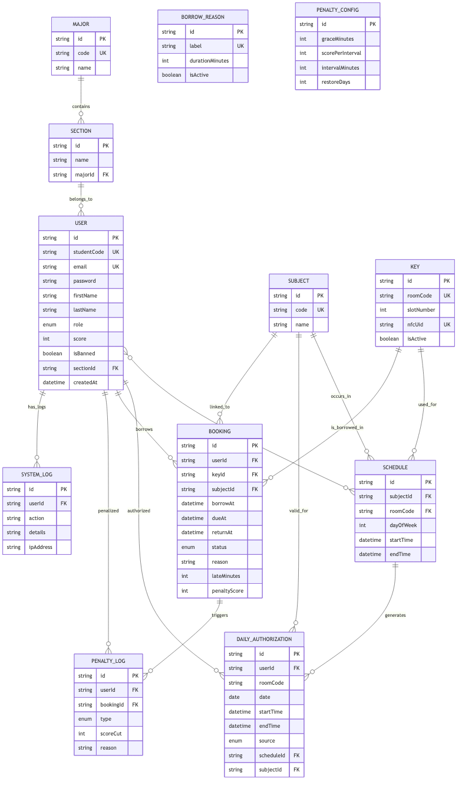

**ภาพที่ 3-2** แสดง Entity Relationship Diagram ของระบบ KMS ซึ่งประกอบไปด้วย
Entity หลักทั้งหมด 11 ตาราง ได้แก่ USER เป็นตารางที่เก็บข้อมูลผู้ใช้งานทุกประเภทในระบบ
ไม่ว่าจะเป็นนักศึกษา อาจารย์ หรือเจ้าหน้าที่ ประกอบด้วยข้อมูลรหัสนักศึกษา อีเมล รหัสผ่าน
บทบาทในระบบ (role) คะแนนพฤติกรรม (score) และสถานะการระงับบัญชี (isBanned)
KEY เป็นตารางที่เก็บข้อมูลกุญแจแต่ละดอก ประกอบด้วยรหัสห้อง (roomCode) หมายเลขช่อง
(slotNumber) และ UID ของ NFC Tag ที่ติดไว้บนกุญแจแต่ละดอก BOOKING เป็นตารางที่
บันทึกรายการเบิกคืนกุญแจทุกครั้ง ประกอบด้วยเวลาเบิก เวลาครบกำหนดคืน เวลาคืนจริง
สถานะ เหตุผล และคะแนนที่ถูกหักในกรณีที่คืนช้า DAILY_AUTHORIZATION เป็นตารางที่
ทำหน้าที่เป็น "ต้นฉบับความจริง" ในการตรวจสอบสิทธิ์เบิกกุญแจของผู้ใช้แต่ละรายในแต่ละวัน
โดยระบบจะดึงข้อมูลจากตาราง SCHEDULE มาสร้างรายการ DailyAuthorization ทุกเช้าโดยอัตโนมัติ
SCHEDULE เป็นตารางที่จัดเก็บตารางสอนประจำสัปดาห์ ระบุวิชา ห้อง วันสอน
และช่วงเวลาสอน SUBJECT เป็นตารางที่จัดเก็บรายชื่อวิชาเรียน PENALTY_LOG เป็น
ตารางที่บันทึกประวัติการหักคะแนนเมื่อผู้ใช้คืนกุญแจล่าช้า SYSTEM_LOG เป็นตาราง
บันทึกการกระทำทุกอย่างในระบบ SECTION และ MAJOR เป็นตารางที่เก็บข้อมูลกลุ่ม
เรียนและสาขาวิชา BORROW_REASON เป็นตารางที่กำหนดเหตุผลที่อนุญาตให้เบิกนอก
ตาราง และ PENALTY_CONFIG เป็นตารางการตั้งค่าระบบหักคะแนน

ความสัมพันธ์ที่สำคัญของระบบ ได้แก่ ความสัมพันธ์ระหว่าง SCHEDULE กับ
DAILY_AUTHORIZATION กล่าวคือ ตารางสอนประจำสัปดาห์จะถูกแปลงเป็น
DailyAuthorization ทุกเช้าของวันนั้น และความสัมพันธ์ระหว่าง BOOKING กับ
PENALTY_LOG กล่าวคือ ทุกครั้งที่มีการคืนกุญแจช้า ระบบจะสร้างบันทึกการหักคะแนน
โดยอัตโนมัติ

### 3.1.2 การออกแบบ Use Case Diagram

ผู้วิจัยได้จัดทำ Use Case Diagram เพื่อแสดงขอบเขตความสามารถของระบบที่แต่ละบทบาทผู้ใช้
สามารถเข้าถึงได้ ดังภาพที่ 3-3

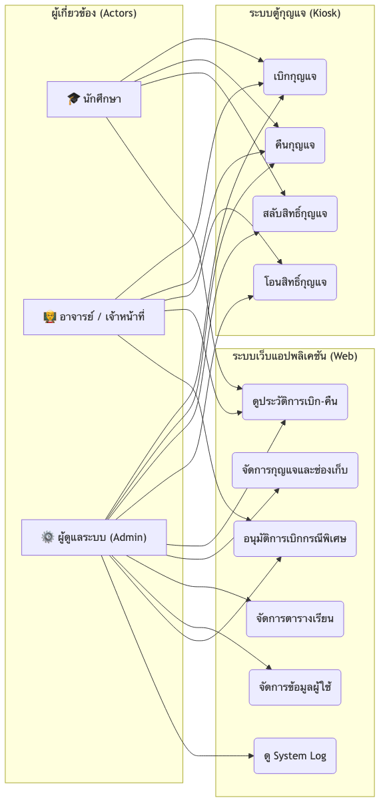

**ภาพที่ 3-3** แสดง Use Case Diagram ของระบบ KMS ซึ่งประกอบไปด้วยผู้ใช้งาน 3 กลุ่ม
ได้แก่ นักศึกษา อาจารย์หรือเจ้าหน้าที่ และผู้ดูแลระบบ โดยมีรายละเอียดสิทธิ์การใช้งาน
ดังต่อไปนี้

นักศึกษาสามารถเบิกกุญแจได้ตามตารางเรียนโดยไม่ต้องระบุเหตุผล หรือเบิกนอกตาราง
โดยต้องระบุเหตุผลก่อนทำรายการ สามารถคืนกุญแจ สลับสิทธิ์กุญแจกับผู้ใช้งานอื่น และ
ตรวจสอบประวัติการเบิกคืนของตนเองได้ อาจารย์หรือเจ้าหน้าที่มีสิทธิ์เบิกกุญแจได้
ทันทีโดยไม่ต้องระบุเหตุผล สามารถโอนสิทธิ์กุญแจให้ผู้อื่น ตรวจสอบประวัติ และอนุมัติ
การเบิกกรณีพิเศษได้ อาจารย์ยังสามารถจัดการตารางสอนของตนเองผ่านระบบเว็บ
ได้อีกด้วย ผู้ดูแลระบบมีสิทธิ์สูงสุด ครอบคลุมทุกฟังก์ชันในระบบ ทั้งการจัดการข้อมูล
ผู้ใช้ การจัดการกุญแจ การกำหนดตารางเรียน และการดู System Log

### 3.1.3 การออกแบบ Sequence Diagram

ผู้วิจัยได้จัดทำ Sequence Diagram สำหรับฟังก์ชันหลักของระบบทั้งหมด 5 ฟังก์ชัน ได้แก่
การเบิกกุญแจ การคืนกุญแจ การสลับสิทธิ์กุญแจ การโอนสิทธิ์กุญแจ และการทำงานของ
เจ้าหน้าที่และอาจารย์ผ่านระบบเว็บ

**3.1.3.1 Sequence Diagram การเบิกกุญแจ** แสดงดังภาพที่ 3-4

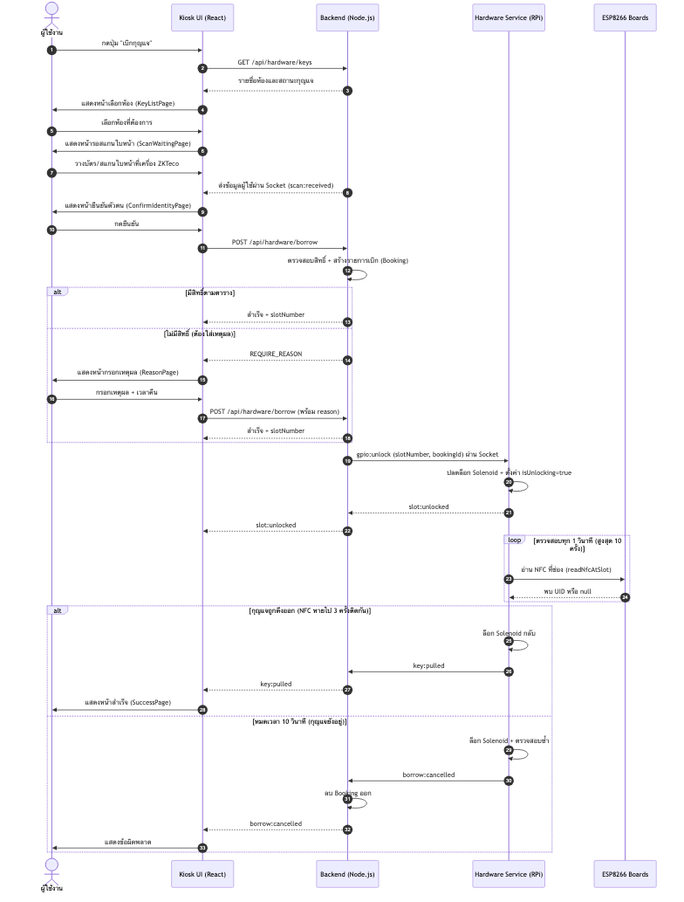

**ภาพที่ 3-4** แสดง Sequence Diagram ของขั้นตอนการเบิกกุญแจ ซึ่งประกอบด้วยการ
ทำงานร่วมกันของ 4 ส่วน ได้แก่ Kiosk UI (React) Backend (Node.js) Hardware Service
(Raspberry Pi) และ ESP8266 Boards โดยมีขั้นตอนการทำงานดังนี้ ผู้ใช้กดปุ่ม "เบิกกุญแจ"
ระบบดึงรายชื่อห้องและสถานะกุญแจมาแสดง ผู้ใช้เลือกห้องที่ต้องการ จากนั้นวางบัตรหรือ
สแกนใบหน้าที่เครื่อง ZKTeco SmartAC1 ระบบ Backend รับข้อมูลผ่าน ADMS Protocol
และส่งข้อมูลผู้ใช้กลับมายัง Kiosk UI ผ่าน Socket Event ชื่อ scan:received ผู้ใช้กดยืนยัน
ระบบตรวจสอบสิทธิ์เบิกจากตาราง DailyAuthorization หากมีสิทธิ์ระบบจะสร้าง Booking
และส่งคำสั่ง gpio:unlock ไปยัง Hardware Service เพื่อปลดล็อก Solenoid ที่ช่องกุญแจที่
ระบุ Hardware Service รอตรวจจับการดึงกุญแจออกผ่าน NFC Polling สูงสุด 10 วินาที
หากไม่ดึงกุญแจออกภายในเวลาที่กำหนด ระบบจะล็อก Solenoid กลับและยกเลิก Booking
โดยอัตโนมัติ

**3.1.3.2 Sequence Diagram การคืนกุญแจ** แสดงดังภาพที่ 3-5

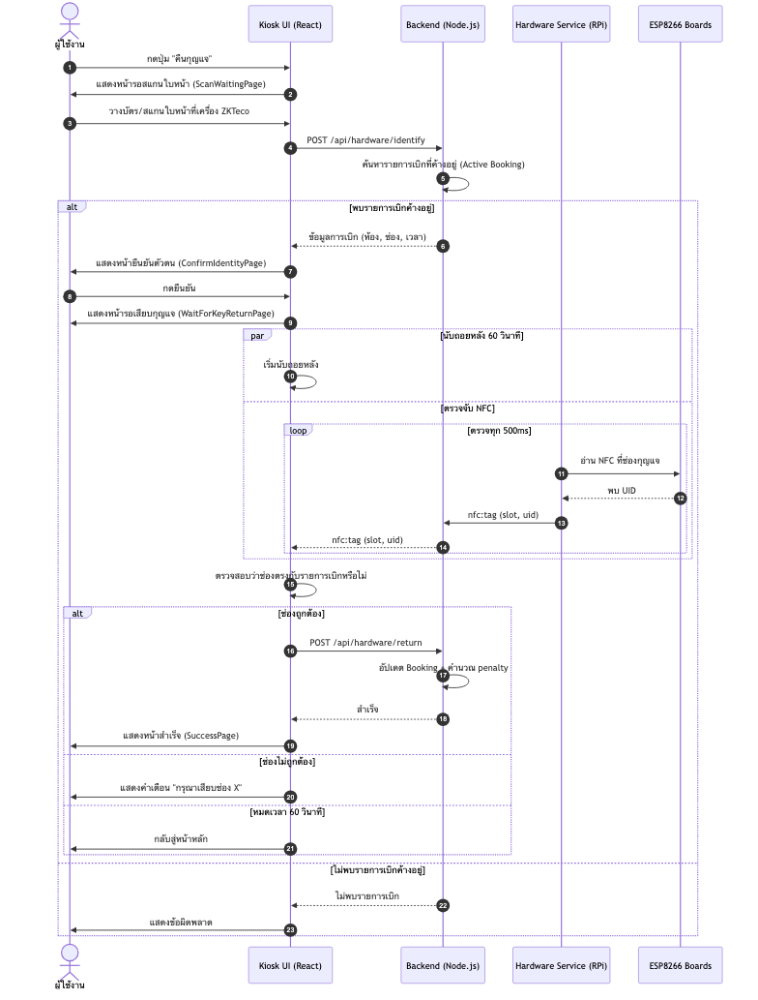

**ภาพที่ 3-5** แสดง Sequence Diagram ของขั้นตอนการคืนกุญแจ โดยผู้ใช้กดปุ่ม "คืนกุญแจ"
สแกนบัตรยืนยันตัวตน ระบบค้นหารายการเบิกที่ค้างอยู่ในฐานข้อมูล หากพบ ระบบจะแสดง
รายการเบิกพร้อมข้อมูลห้องและช่องกุญแจ ผู้ใช้กดยืนยัน ระบบเข้าสู่โหมดรอการตรวจจับ
NFC พร้อมนับถอยหลัง 60 วินาที เมื่อผู้ใช้เสียบกุญแจลงในช่อง ESP8266 จะตรวจจับ
NFC Tag และส่งสัญญาณกลับมายัง Backend ผ่าน Socket Event Hardware Service
ส่ง Event nfc:tag พร้อมหมายเลขช่องและ UID ไปยัง Kiosk UI ระบบตรวจสอบว่าช่อง
ตรงกับรายการเบิกหรือไม่ หากถูกต้องระบบจะปิดรายการเบิกและคำนวณ penalty กรณีคืน
ล่าช้า

**3.1.3.3 Sequence Diagram การสลับสิทธิ์กุญแจ** แสดงดังภาพที่ 3-6

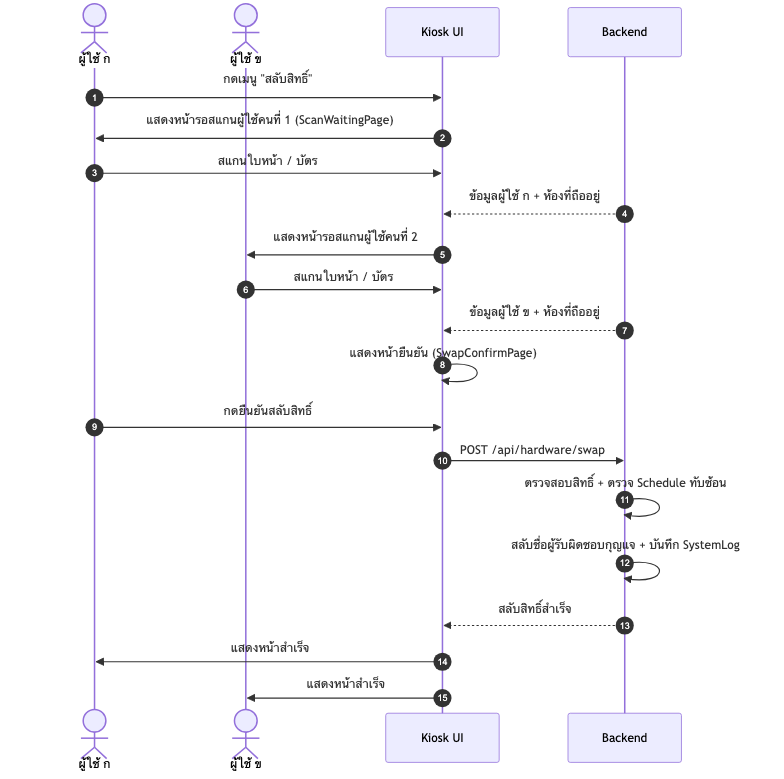

**ภาพที่ 3-6** แสดง Sequence Diagram ของขั้นตอนการสลับสิทธิ์กุญแจ ฟังก์ชันนี้
ออกแบบสำหรับผู้ใช้ 2 คนที่ต้องการแลกเปลี่ยนสิทธิ์ห้องกันโดยไม่ต้องนำกุญแจมาคืน
ที่ตู้ก่อน ผู้ใช้คนที่ 1 สแกนบัตร ระบบดึงข้อมูลห้องที่ถืออยู่ ผู้ใช้คนที่ 2 สแกนบัตร
ระบบดึงข้อมูลห้องของผู้ใช้คนที่ 2 ระบบแสดงหน้ายืนยัน ผู้ใช้ยืนยัน ระบบตรวจสอบ
ว่าตารางเรียนไม่ทับซ้อนกัน จึงอนุญาตและดำเนินการสลับสิทธิ์ พร้อมบันทึกใน
SystemLog

**3.1.3.4 Sequence Diagram การโอนสิทธิ์กุญแจ** แสดงดังภาพที่ 3-7

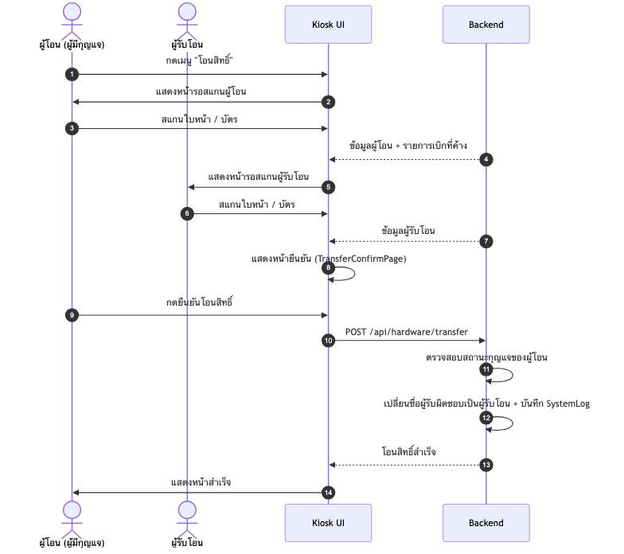

**ภาพที่ 3-7** แสดง Sequence Diagram ของขั้นตอนการโอนสิทธิ์กุญแจ ฟังก์ชัน Transfer
ออกแบบสำหรับกรณีที่ผู้มีกุญแจต้องการมอบความรับผิดชอบให้ผู้อื่น โดยผู้โอนสแกนบัตร
ยืนยันตัวตน ผู้รับโอนสแกนบัตร ระบบแสดงข้อมูลทั้งสองฝ่ายพร้อมขอการยืนยัน หลังยืนยัน
ระบบเปลี่ยนชื่อผู้รับผิดชอบใน Booking ปัจจุบันเป็นผู้รับโอน และบันทึกประวัติในตาราง
SystemLog

**3.1.3.5 Sequence Diagram การทำงานของเจ้าหน้าที่และอาจารย์** แสดงดังภาพที่ 3-8

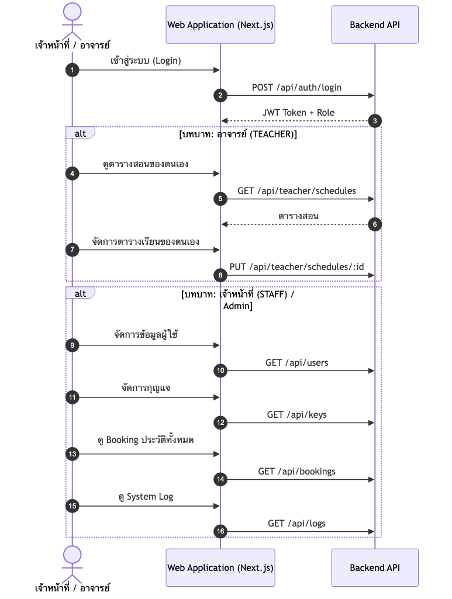

**ภาพที่ 3-8** แสดง Sequence Diagram ของขั้นตอนการทำงานของเจ้าหน้าที่และอาจารย์
ผ่านระบบเว็บ โดยผู้ใช้เข้าสู่ระบบด้วย username และ password ระบบตรวจสอบและ
ออก JWT Token กำหนดสิทธิ์ตามบทบาท อาจารย์สามารถจัดการตารางสอนของตนเอง
เจ้าหน้าที่และ Admin สามารถจัดการข้อมูลผู้ใช้ กุญแจ ตารางเรียน และดูประวัติการเบิก
คืนทั้งหมดในระบบ

---

## 3.2 ระยะที่ 2: การพัฒนาซอฟต์แวร์

การพัฒนาซอฟต์แวร์ของระบบ KMS แบ่งออกเป็น 3 ส่วนหลัก ได้แก่ ระบบ Kiosk UI
สำหรับตู้กุญแจ ระบบ Web Dashboard สำหรับเจ้าหน้าที่และอาจารย์ และระบบ Backend
Web Service โดยทุกส่วนทำงานร่วมกันผ่าน REST API และ Socket.IO แบบ Real-time

### 3.2.1 ระบบ Kiosk UI (ตู้กุญแจ)

ระบบ Kiosk UI พัฒนาด้วย React และ Vite ทำงานบน Raspberry Pi 5 ที่เชื่อมต่อ
กับจอแสดงผลแบบ Touch Screen ใช้สถาปัตยกรรมแบบ State Machine ในไฟล์ App.jsx
เพื่อควบคุมการเปลี่ยนหน้าจออย่างเป็นระบบ โดยรับ Socket Events จาก Backend
และอัปเดตสถานะการแสดงผลตามลำดับ Kiosk UI ประกอบด้วยหน้าต่างๆ ดังนี้

**3.2.1.1 หน้าหลัก (HomePage)**

หน้าหลักเป็นหน้าแรกที่ผู้ใช้งานพบเมื่อเข้าใช้งานตู้กุญแจ ออกแบบให้แสดงเมนูหลัก
4 ตัวเลือก ได้แก่ ปุ่มเบิกกุญแจ ปุ่มคืนกุญแจ ปุ่มสลับสิทธิ์ และปุ่มโอนสิทธิ์ โดยแต่ละ
ปุ่มมีขนาดใหญ่เพื่อรองรับการสัมผัสบนจอ Touch Screen ระบบจะกลับมาแสดงหน้าหลัก
โดยอัตโนมัติเมื่อการทำรายการสำเร็จหรือหมดเวลา ดังแสดงในภาพที่ 3-9

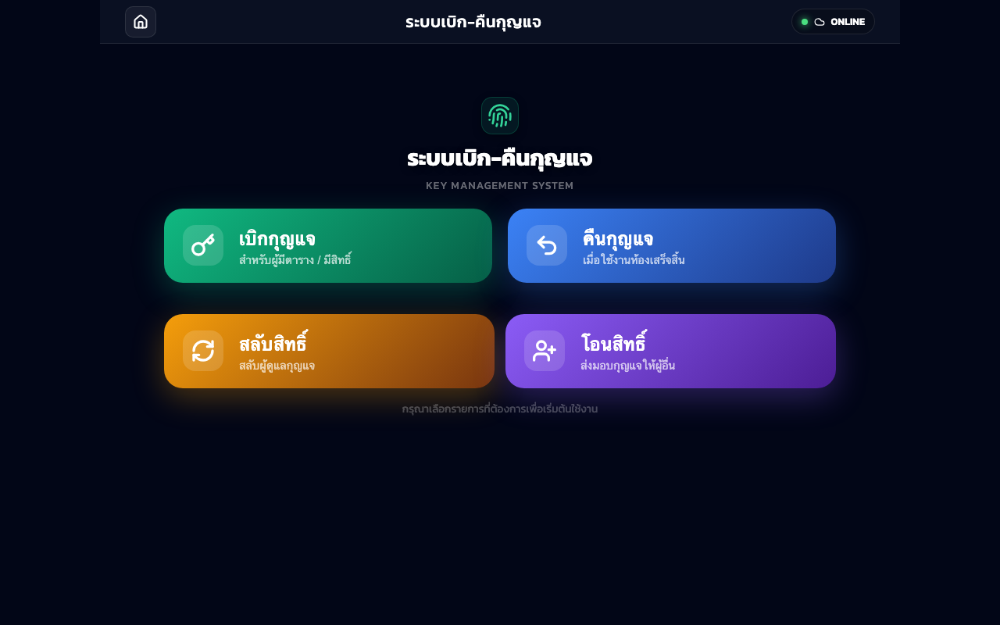

**ภาพที่ 3-9** แสดงหน้าหลักของระบบ Kiosk UI ประกอบด้วยปุ่มเมนูหลัก 4 ปุ่ม
ได้แก่ เบิกกุญแจ คืนกุญแจ สลับสิทธิ์ และโอนสิทธิ์

**3.2.1.2 หน้าเลือกห้อง (KeyListPage)**

หน้าเลือกห้องทำหน้าที่ดึงรายชื่อกุญแจและสถานะทั้งหมดจาก Backend ผ่าน
GET /api/hardware/keys และแสดงผลแบบ Real-time ผ่าน Socket.IO ช่องกุญแจแต่ละ
ช่องจะแสดงรหัสห้อง ชื่อห้อง และสถานะปัจจุบัน โดยช่องที่ว่าง (มีกุญแจอยู่) จะสามารถ
กดเลือกได้ ส่วนช่องที่ถูกเบิกออกไปแล้วจะแสดงเป็นสีเทาและไม่สามารถกดได้
ดังแสดงในภาพที่ 3-10

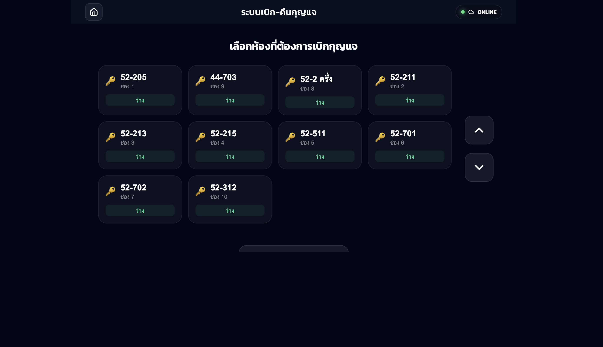

**ภาพที่ 3-10** แสดงหน้าเลือกห้องของระบบ Kiosk UI ซึ่งแสดงรายชื่อกุญแจทั้งหมด
พร้อมสถานะว่างหรือถูกเบิกแบบ Real-time

**3.2.1.3 หน้ารอสแกนบัตร (ScanWaitingPage)**

หน้ารอสแกนบัตรทำหน้าที่แสดงคำแนะนำให้ผู้ใช้วางบัตร NFC หรือสแกนใบหน้าที่
เครื่อง ZKTeco SmartAC1 ระบบรอรับข้อมูลผ่าน Socket Event ชื่อ scan:received
จาก Backend เมื่อเครื่อง ZKTeco อ่านข้อมูลสำเร็จ หน้าจะเปลี่ยนไปยังหน้ายืนยัน
ตัวตนโดยอัตโนมัติ ดังแสดงในภาพที่ 3-11

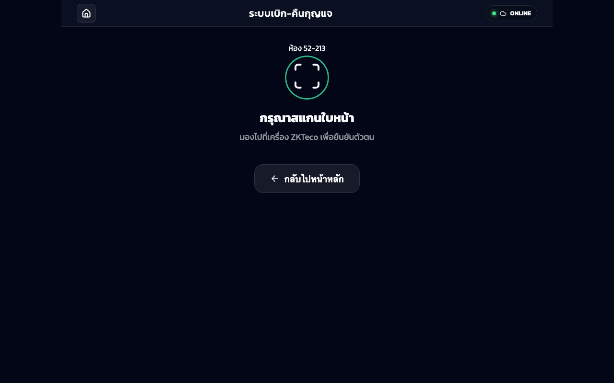

**ภาพที่ 3-11** แสดงหน้ารอสแกนบัตรของระบบ Kiosk UI ซึ่งรอรับข้อมูลจาก
เครื่อง ZKTeco SmartAC1 ผ่าน Socket.IO

**3.2.1.4 หน้ายืนยันตัวตน (ConfirmIdentityPage)**

หน้ายืนยันตัวตนทำหน้าที่แสดงรูปภาพและข้อมูลของผู้ใช้ที่สแกนมาได้ ได้แก่
ชื่อ-นามสกุล รหัสนักศึกษา และบทบาทในระบบ เพื่อให้ผู้ใช้ยืนยันว่าตรงกับตนเอง
ก่อนดำเนินการต่อ หากผู้ใช้กดยืนยัน ระบบจะดำเนินการตามเมนูที่เลือกไว้ก่อนหน้า
ดังแสดงในภาพที่ 3-12

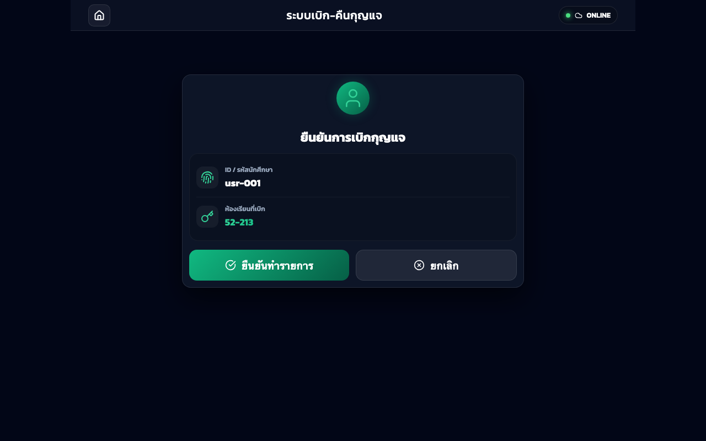

**ภาพที่ 3-12** แสดงหน้ายืนยันตัวตนของระบบ Kiosk UI ซึ่งแสดงข้อมูลและรูปภาพ
ของผู้ใช้ที่สแกนมาเพื่อให้ผู้ใช้ยืนยันก่อนดำเนินการ

**3.2.1.5 หน้ากรอกเหตุผล (ReasonPage)**

หน้ากรอกเหตุผลจะปรากฏขึ้นเฉพาะกรณีที่ผู้ใช้ไม่มีสิทธิ์เบิกกุญแจตามตารางเรียน
ระบบจะแสดงรายการเหตุผลที่อนุมัติให้เลือก เช่น ประชุม อบรม ซ่อมแซม พร้อมให้
ผู้ใช้ระบุเวลาที่คาดว่าจะคืนกุญแจ ข้อมูลทั้งหมดจะถูกส่งไปพร้อมกับคำสั่งเบิกกุญแจ
เพื่อบันทึกเหตุผลไว้ใน Booking Record ดังแสดงในภาพที่ 3-13

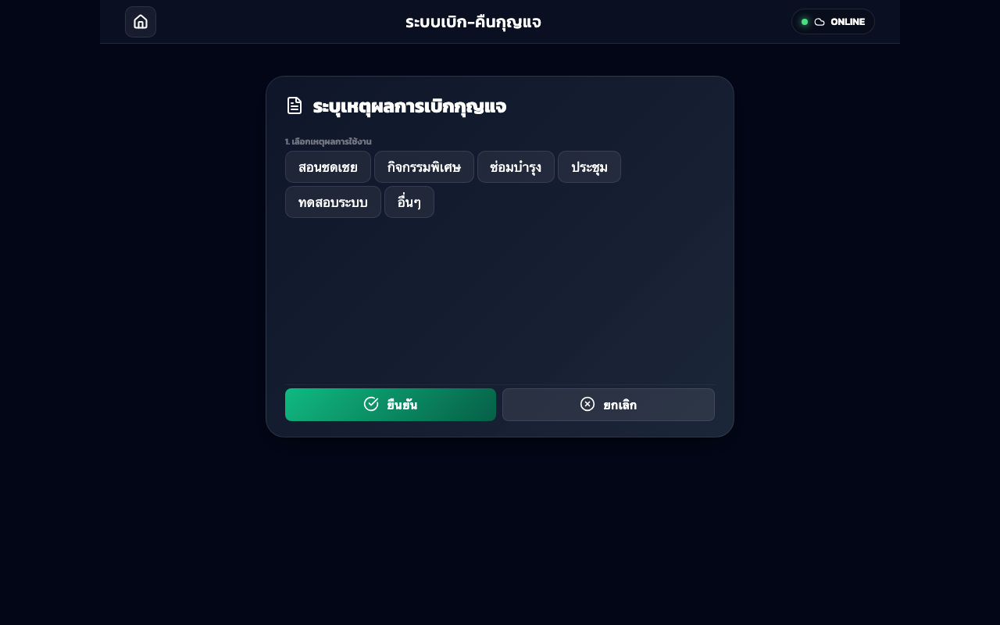

**ภาพที่ 3-13** แสดงหน้ากรอกเหตุผลของระบบ Kiosk UI สำหรับกรณีที่ไม่มีสิทธิ์
ตามตารางเรียน ผู้ใช้ต้องเลือกเหตุผลและระบุเวลาคืนกุญแจ

**3.2.1.6 หน้ารอคืนกุญแจ (WaitForKeyReturnPage)**

หน้ารอคืนกุญแจปรากฏขึ้นหลังจากผู้ใช้ยืนยันการคืนกุญแจแล้ว ระบบจะแสดง
คำแนะนำให้ผู้ใช้เสียบกุญแจลงในช่องที่ถูกต้อง พร้อมนับถอยหลัง 60 วินาที
Hardware Service ส่งสัญญาณ NFC Tag มายังหน้านี้ผ่าน Socket Event nfc:tag
หากผู้ใช้เสียบกุญแจถูกช่อง ระบบจะยืนยันและปิดรายการเบิกทันที ดังแสดง
ในภาพที่ 3-14

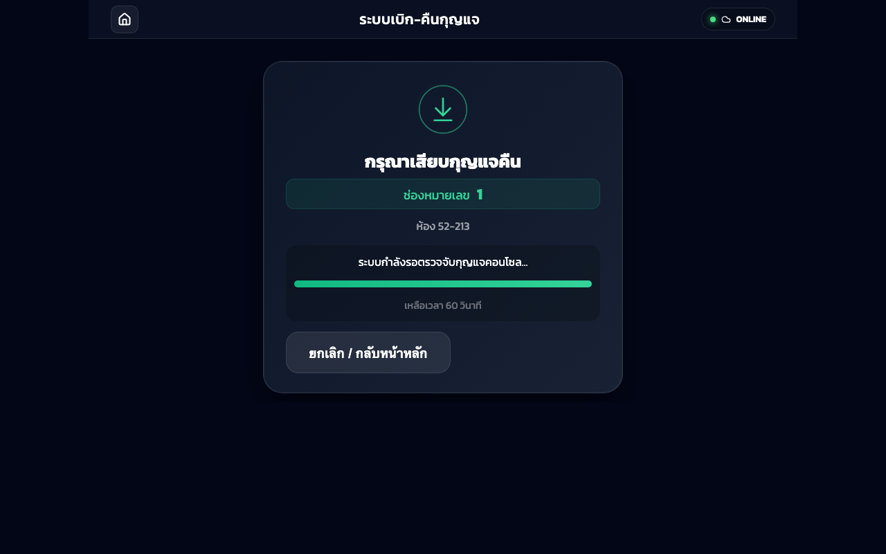

**ภาพที่ 3-14** แสดงหน้ารอคืนกุญแจของระบบ Kiosk UI พร้อมนับถอยหลัง 60 วินาที
รอรับสัญญาณ NFC จาก ESP8266 เมื่อผู้ใช้เสียบกุญแจลงช่อง

**3.2.1.7 หน้าสำเร็จ (SuccessPage)**

หน้าสำเร็จแสดงขึ้นหลังจากการทำรายการใดๆ สำเร็จ ไม่ว่าจะเป็นการเบิก คืน
สลับ หรือโอนสิทธิ์ หน้าจะแสดงข้อความยืนยันพร้อมรายละเอียดของการทำรายการ
และนับถอยหลัง 5 วินาทีก่อนกลับสู่หน้าหลักโดยอัตโนมัติ ดังแสดงในภาพที่ 3-15

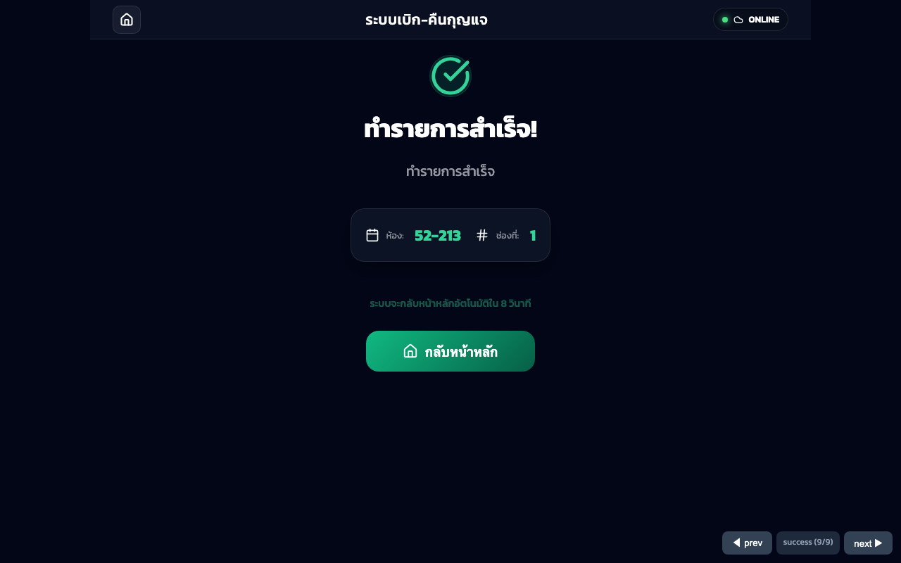

**ภาพที่ 3-15** แสดงหน้าสำเร็จของระบบ Kiosk UI หลังทำรายการเสร็จสิ้น
ระบบจะนับถอยหลัง 5 วินาทีก่อนกลับหน้าหลักอัตโนมัติ

**3.2.1.8 หน้ายืนยันสลับสิทธิ์ (SwapConfirmPage)**

หน้ายืนยันสลับสิทธิ์จะแสดงขึ้นหลังจากสแกนบัตรของผู้ใช้ 2 คนเรียบร้อยแล้ว
ระบบแสดงข้อมูลของทั้งสองฝ่าย ได้แก่ ชื่อและรหัสห้องที่แต่ละคนถืออยู่ เพื่อให้
ยืนยันว่าต้องการสลับสิทธิ์จริง เมื่อยืนยันแล้วระบบจะตรวจสอบว่าตารางเรียน
ของทั้งสองคนไม่ทับซ้อนกันก่อนดำเนินการสลับ ดังแสดงในภาพที่ 3-16

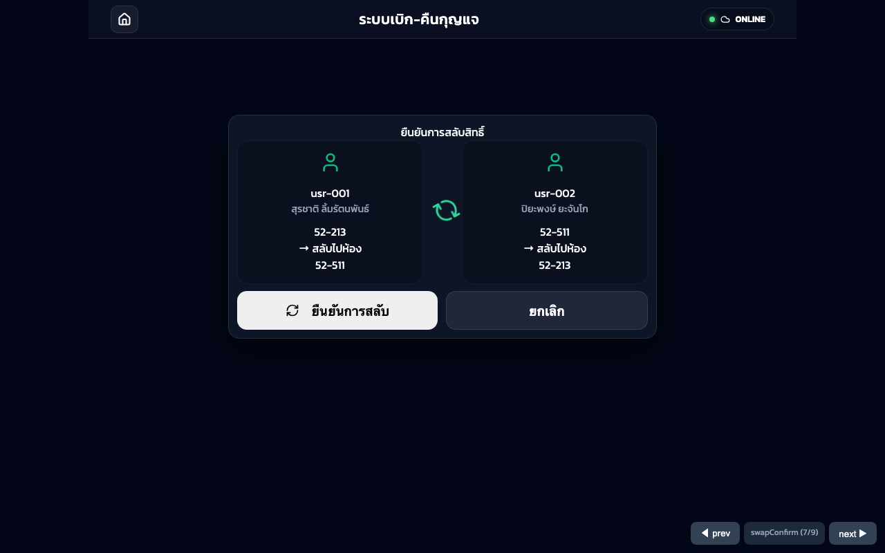

**ภาพที่ 3-16** แสดงหน้ายืนยันสลับสิทธิ์กุญแจของระบบ Kiosk UI แสดงข้อมูล
ของผู้ใช้ทั้ง 2 คนพร้อมห้องที่จะสลับกัน

**3.2.1.9 หน้ายืนยันโอนสิทธิ์ (TransferConfirmPage)**

หน้ายืนยันโอนสิทธิ์จะแสดงขึ้นหลังสแกนบัตรของทั้งผู้โอนและผู้รับ ระบบแสดง
รายละเอียดรายการเบิกของผู้โอน ได้แก่ รหัสห้อง เวลาเบิก และเวลาครบกำหนดคืน
พร้อมชื่อผู้รับโอน เพื่อให้ยืนยันก่อนดำเนินการ เมื่อยืนยัน ระบบจะเปลี่ยนชื่อ
ผู้รับผิดชอบ Booking และบันทึก SystemLog ดังแสดงในภาพที่ 3-17

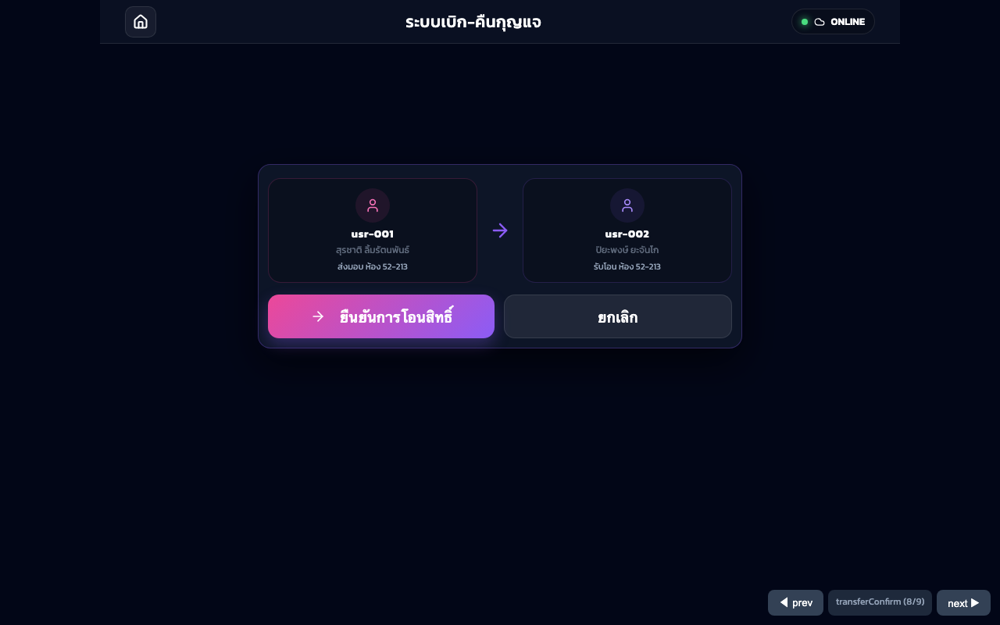

**ภาพที่ 3-17** แสดงหน้ายืนยันโอนสิทธิ์กุญแจของระบบ Kiosk UI แสดงข้อมูล
ผู้โอนและผู้รับก่อนยืนยันการโอน

---

### 3.2.2 ระบบ Web Dashboard (เจ้าหน้าที่และอาจารย์)

ระบบ Web Dashboard พัฒนาด้วย Next.js ให้เจ้าหน้าที่และอาจารย์สามารถจัดการ
ระบบ KMS ผ่าน Browser ได้สะดวก ประกอบด้วยหน้าต่างๆ ดังนี้

**3.2.2.1 หน้าเข้าสู่ระบบ (Login)**

หน้าเข้าสู่ระบบให้ผู้ใช้กรอก username และ password ระบบตรวจสอบข้อมูลและออก
JWT Token กำหนดสิทธิ์ตามบทบาท (Role) ของบัญชีนั้นๆ และนำผู้ใช้ไปยัง Dashboard
ที่เหมาะสมกับบทบาทโดยอัตโนมัติ ดังแสดงในภาพที่ 3-18

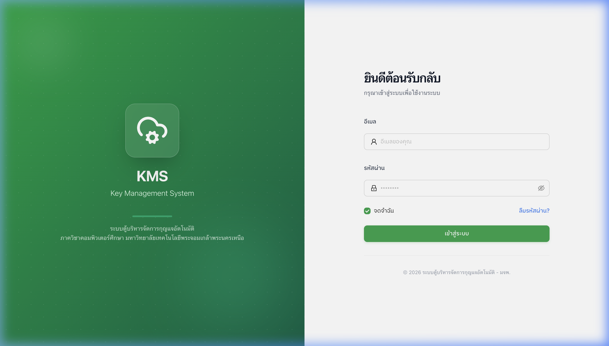

**ภาพที่ 3-18** แสดงหน้าเข้าสู่ระบบของ Web Dashboard สำหรับเจ้าหน้าที่และอาจารย์

**3.2.2.2 หน้า Dashboard (ภาพรวมระบบ)**

หน้า Dashboard แสดงสถานะกุญแจทั้งหมดในระบบแบบ Real-time โดยอัปเดตผ่าน
Socket.IO ทันทีเมื่อมีการเบิกหรือคืนกุญแจ นอกจากนี้ยังแสดงสถิติการใช้งาน
เช่น จำนวนการเบิกในวันนี้ จำนวนกุญแจที่อยู่นอกตู้ และจำนวนรายการที่เกินกำหนด
ดังแสดงในภาพที่ 3-19

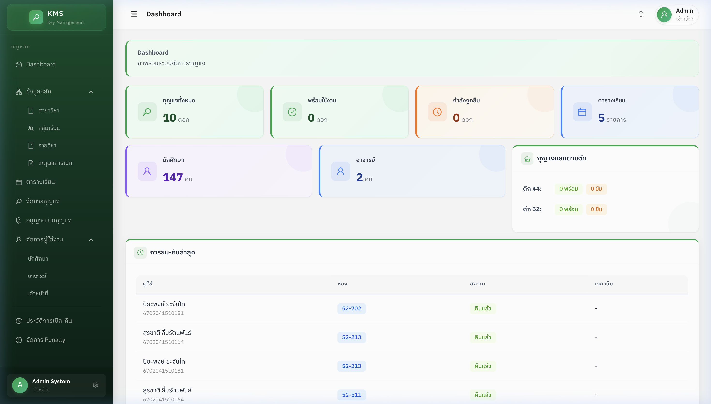

**ภาพที่ 3-19** แสดงหน้า Dashboard ของ Web Dashboard ซึ่งแสดงสถานะกุญแจ
ทั้งหมดแบบ Real-time และสถิติการใช้งาน

**3.2.2.3 หน้าจัดการผู้ใช้งาน (Users)**

หน้าจัดการผู้ใช้งานช่วยให้ Admin สามารถดูรายชื่อผู้ใช้ทั้งหมด เพิ่มผู้ใช้ใหม่
แก้ไขข้อมูล เปลี่ยนบทบาท และระงับบัญชีผู้ใช้ได้ นอกจากนี้ยังรองรับการนำเข้า
ข้อมูลนักศึกษาจำนวนมากจากไฟล์ Excel (.xlsx) ได้ในครั้งเดียว ดังแสดงในภาพที่ 3-20

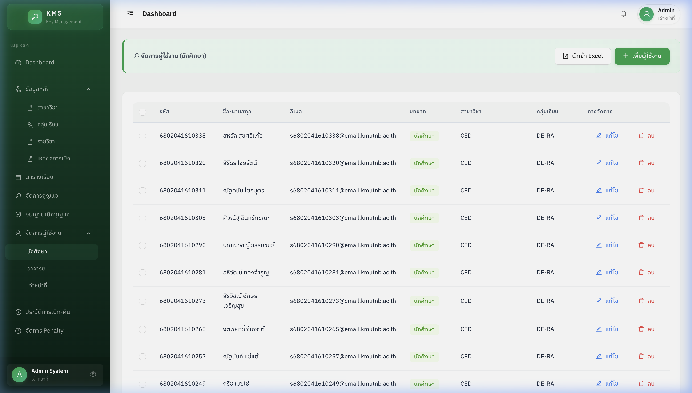

**ภาพที่ 3-20** แสดงหน้าจัดการผู้ใช้งานของ Web Dashboard

**3.2.2.4 หน้าจัดการกุญแจ (Keys)**

หน้าจัดการกุญแจแสดงรายการกุญแจทั้งหมดในระบบ พร้อมสถานะ รหัสห้อง หมายเลขช่อง
และ NFC UID Admin สามารถเพิ่มกุญแจใหม่ แก้ไขข้อมูล และเปิดปิดการใช้งานกุญแจ
แต่ละดอกได้ ดังแสดงในภาพที่ 3-21

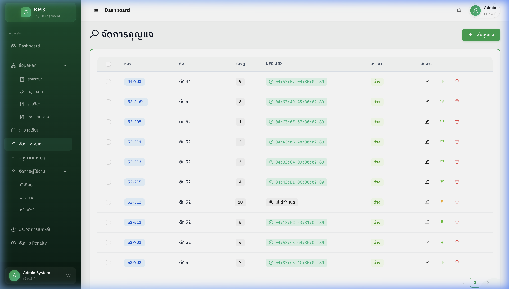

**ภาพที่ 3-21** แสดงหน้าจัดการกุญแจของ Web Dashboard

**3.2.2.5 หน้าจัดการตารางสอน (Schedules)**

หน้าจัดการตารางสอนช่วยให้เจ้าหน้าที่และอาจารย์สามารถสร้าง แก้ไข และลบ
ตารางสอนได้ นอกจากนี้ยังรองรับการนำเข้าตารางสอนจากไฟล์ Excel ระบบจะนำ
ตารางสอนไปสร้าง DailyAuthorization ให้อัตโนมัติทุกเช้า ดังแสดงในภาพที่ 3-22

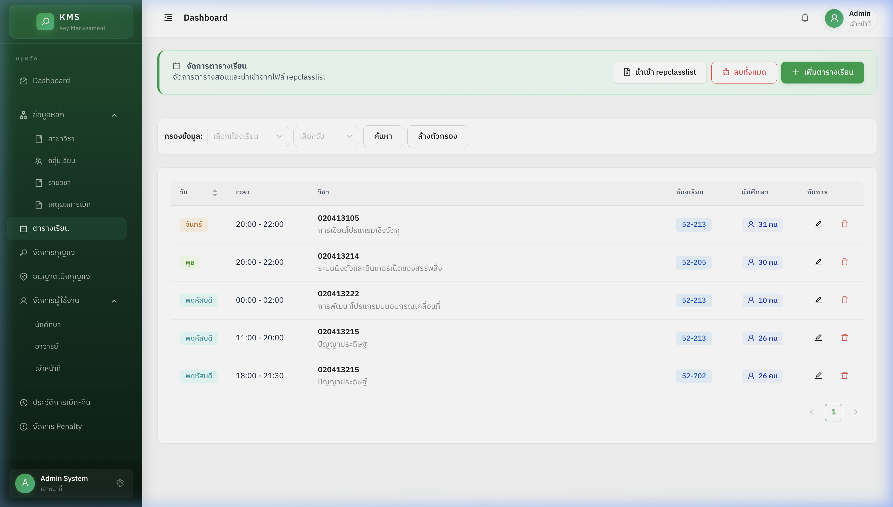

**ภาพที่ 3-22** แสดงหน้าจัดการตารางสอนของ Web Dashboard

**3.2.2.6 หน้าประวัติการเบิก-คืน (Bookings)**

หน้าประวัติการเบิกคืนแสดงรายการ Booking ทั้งหมดในระบบ สามารถกรองข้อมูล
ตามวันที่ ห้อง หรือผู้ใช้ได้ แต่ละรายการแสดงข้อมูลครบถ้วน ได้แก่ ชื่อผู้เบิก
รหัสห้อง เวลาเบิก เวลาคืน สถานะ และคะแนนที่ถูกหัก ดังแสดงในภาพที่ 3-23

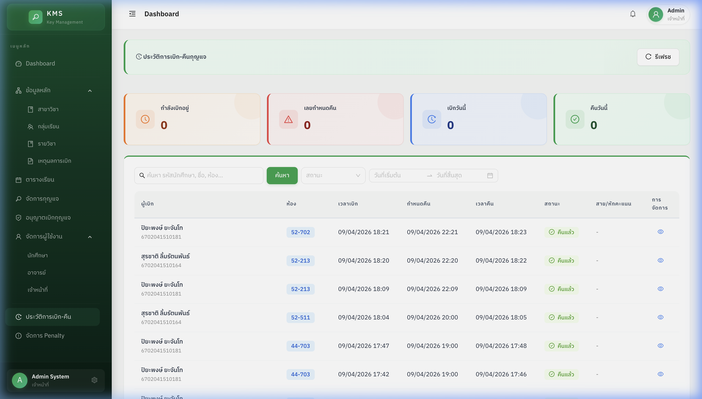

**ภาพที่ 3-23** แสดงหน้าประวัติการเบิกคืนกุญแจของ Web Dashboard

**3.2.2.7 หน้า System Log**

หน้า System Log แสดงบันทึกการกระทำทุกอย่างที่เกิดขึ้นในระบบ ไม่ว่าจะเป็น
การเบิก คืน สลับ โอน หรือการเปลี่ยนแปลงข้อมูลโดย Admin พร้อมข้อมูล IP Address
เพื่อช่วยในการตรวจสอบความถูกต้องและความปลอดภัยของระบบ ดังแสดงในภาพที่ 3-24

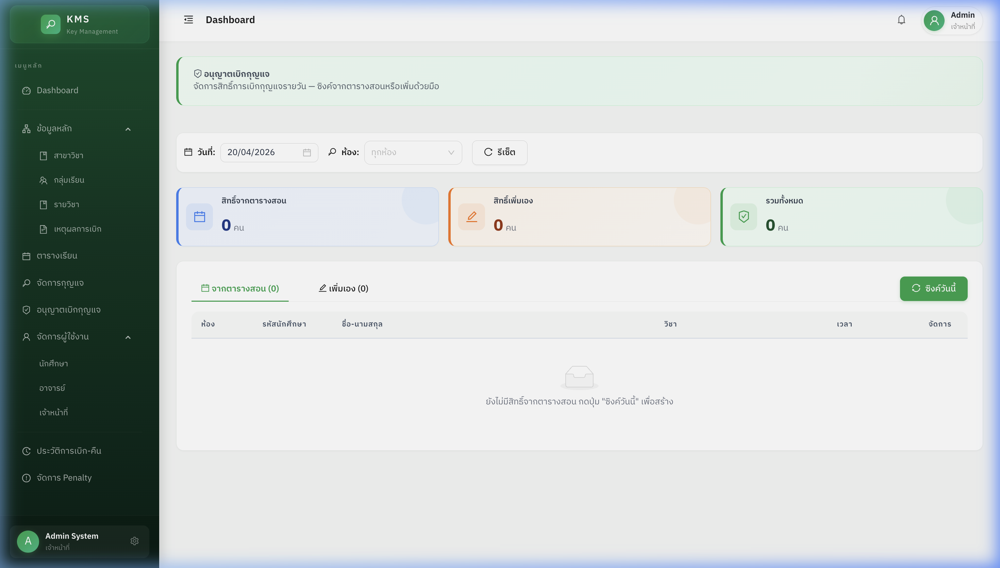

**ภาพที่ 3-24** แสดงหน้า System Log ของ Web Dashboard

---

### 3.2.3 ระบบ Backend Web Service

ส่วน Backend ของระบบ Key Management System (KMS) พัฒนาขึ้นโดยใช้ภาษา **JavaScript** ทำงานบนสภาพแวดล้อม **Node.js** ร่วมกับเทคโนโลยีหลักในการอ้างอิงและประมวลผลดังนี้
- **Express.js**: สำหรับสร้างโครงสร้าง REST API และจัดการเส้นทางรับส่งข้อมูลในระบบ
- **Prisma ORM**: สำหรับติดต่อและจัดการโครงสร้างฐานข้อมูลแบบ Object-Relational Mapping (ORM) ควบคู่กับฐานข้อมูล **PostgreSQL** เพื่อความปลอดภัยและมีประสิทธิภาพ
- **Socket.IO**: สำหรับสื่อสารข้อมูลและส่งคำสั่งควบคุมฮาร์ดแวร์แบบเรียลไทม์ (Real-time Communication)

**3.2.3.1 ภาพรวมการทำงาน (Software Workflow)**

การทำงานของระบบ Backend ถูกออกแบบให้ส่งผ่านข้อมูลเป็นลำดับขั้นตอนเพื่อความปลอดภัยและการจัดการที่ง่าย โดยมีภาพรวมกระบวนการทำงานดังภาพที่ 3-25

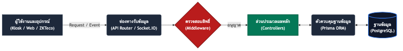

**ภาพที่ 3-25** แสดงแผนภาพภาพรวมขั้นตอนการไหลของข้อมูลหลัก (Workflow) เมื่อมีคำสั่งส่งเข้ามาจากพอร์ตต่างๆ (Kiosk, Web Dashboard หรือ ZKTeco) ข้อมูลจะผ่านตัวรับคำสั่ง (Router หรือ Socket) ไปยังส่วนตรวจสอบสิทธิ์ (Middleware) เพื่อเช็คความปลอดภัยของ Token จากนั้นส่งต่อให้ส่วนประมวลผล (Controllers) ทำบรรทัดฐานทางตรรกะ และจบด้วยการใช้ Prisma ติดต่อกับฐานข้อมูลเพื่อแก้ไขหรือดึงข้อมูล

**3.2.3.2 เส้นทางการเชื่อมต่อรับส่งข้อมูล (API Routes เต็มรูปแบบ)**

เพื่อให้โปรแกรมย่อยแต่ละส่วนทำงานร่วมกันได้อย่างครบถ้วน ระบบ Backend ได้เปิดช่องทางการเชื่อมต่อ API ครอบคลุมทุกระบบงาน ดังรายละเอียดในตารางที่ 3-1 ถึง 3-5

**ตารางที่ 3-1** API Routes สำหรับระบบ Kiosk และ Hardware (ส่วนที่ต้องใช้ HARDWARE_TOKEN)

| Method | Route | หน้าที่การทำงาน |
|:---:|---|---|
| GET | /api/hardware/keys | ดึงรายชื่อกุญแจทั้งหมดพร้อมสถานะปัจจุบัน |
| GET | /api/hardware/room-status | ดึงสถานะกุญแจ (ว่าง/ยืม) แยกตามรายห้อง |
| GET | /api/hardware/user/:studentCode/status | ดูสถานะและสิทธิ์การเบิกกุญแจของผู้ใช้แต่ละคน |
| POST | /api/hardware/identify | รับ NFC UID หรือ รหัสพนักงาน จากเครื่อง ZKTeco เพื่ออ้างอิงตัวตน |
| POST | /api/hardware/borrow | สร้างรายการเบิกกุญแจ ตรวจสอบสิทธิ์ และสั่งปลดล็อก Solenoid |
| POST | /api/hardware/return | ปิดรายการเบิก ตรวจนับเวลาเกิน และคำนวณหักคะแนนอัตโนมัติ |
| POST | /api/hardware/swap | ทำการสลับสิทธิ์ผู้ถือกุญแจระหว่าง 2 คน |
| POST | /api/hardware/check-swap-eligibility | ตรวจสอบความเป็นไปได้ก่อนสลับสิทธิ์ว่าติดตารางเรียนหรือไม่ |
| POST | /api/hardware/transfer | ทำการโอนสิทธิ์กุญแจไปให้อีกคน |
| POST | /api/hardware/check-transfer-eligibility | ตรวจสอบความเป็นไปได้ก่อนโอนสิทธิ์กุญแจ |
| POST | /api/hardware/move | แอดมินใช้สำหรับย้ายกุญแจจากช่องหนึ่งไปอีกช่องหนึ่ง |
| GET | /api/kiosk/rooms/status | อ่านสถานะห้องทั้งหมดว่ากุญแจถูกเบิกไปแล้วกี่ดอก ว่างกี่ดอก |
| GET | /api/kiosk/room-schedule/:roomCode | อ่านตารางเรียนของห้องนั้นๆ เพื่อนำไปแสดงผลบนหน้าจอ Kiosk |

**ตารางที่ 3-2** API Routes สำหรับเชื่อมต่อ ZKTeco SmartAC1 (ADMS Protocol)

| Method | Route | หน้าที่การทำงาน |
|:---:|---|---|
| ALL | /adms/cdata | ส่งข้อมูล Attendance (สแกนหน้า/บัตร) กลับเข้าเซิร์ฟเวอร์ |
| POST | /adms/registry | ลงทะเบียนบอร์ด ZKTeco ครั้งแรกเข้ากับระบบ |
| GET | /adms/getrequest | อุปกรณ์ ZKTeco ส่ง Request ขอคำสั่งรอบถัดไปจาก Server (Polling) |

**ตารางที่ 3-3** API Routes สำหรับการยืนยันตัวตน (Authentication)

| Method | Route | หน้าที่การทำงาน |
|:---:|---|---|
| POST | /api/auth/login | เข้าสู่ระบบสำหรับ Staff, Admin และ Teacher |
| GET | /api/auth/decode-token | ถอดรหัสและตรวจสอบอายุของ JWT Token |
| POST | /api/auth/reset-password | ส่งคำขอ Reset รหัสผ่านไปยัง Email |
| POST | /api/auth/verify-otp | ตรวจสอบรหัส OTP สำหรับการกู้คืนรหัสผ่าน |

**ตารางที่ 3-4** API Routes สำหรับสถิติและประวัติ (Statistics & Reporting)

| Method | Route | หน้าที่การทำงาน |
|:---:|---|---|
| GET | /api/statistics/dashboard | ดึงภาพรวมสถิติไปโชว์ที่ Web Dashboard (กล่องสรุป) |
| GET | /api/statistics/recent | ดูรายการเบิกคืนกุญแจล่าสุด 5 รายการ |
| GET | /api/statistics/top-rooms | ดูอันดับห้องที่มีการใช้งานมากที่สุด |
| GET | /api/statistics/today | สรุปรายงานการเบิกห้องในวันปัจจุบัน |
| GET | /api/bookings | ดูประวัติ Log ทุกรายการเบิก-คืน |
| GET | /api/transactions | ดูประวัติระบบเชิงลึก (System Logs) เช่น การโอน/สลับ/ผิดพลาด |

**ตารางที่ 3-5** API Routes สำหรับจัดการข้อมูลหลักผ่าน Web Dashboard (CRUD)

| Method | Route | หน้าที่การทำงาน |
|:---:|---|---|
| CRUD | /api/users, /api/users/:id | เพิ่ม ลบ แก้ไข ผู้ใช้งาน (แอดมิน, อาจารย์, นักศึกษา) |
| GET/POST | /api/users/teachers, /api/users/batch-import | เรียกดูเฉพาะอาจารย์ และ นำเข้าข้อมูลผู้ใช้ผ่าน Excel |
| CRUD | /api/keys, /api/keys/:id | จัดการช่องกุญแจและผูกรหัส NFC UID |
| CRUD | /api/schedules, /api/subjects | จัดการตารางสอน, เวลาเรียน และเทอมที่ใช้เรียน |
| POST | /api/schedules/batch-import | นำเข้าตารางสอนหลายรายการพร้อมกัน |
| POST | /api/schedules/import-repclasslist | นำเข้าตารางสอนจากไฟล์ RepClassList ของมหาลัย |
| CRUD | /api/major, /api/sections | ตั้งค่าคณะ/สาขา และกลุ่มเรียน (Section) ในระบบ |
| CRUD | /api/authorizations | จัดการการผูกสิทธิ์ประจำวันแบบพิเศษที่ไม่ผ่านตารางสอน |
| POST | /api/authorizations/sync-today | บังคับดึงตารางสอนมาออกสิทธิ์ให้สำหรับวันนี้ทันที |
| GET/PUT | /api/penalty/config | ตั้งค่าเกณฑ์การหักคะแนนความประพฤติ |
| GET/POST | /api/penalty/manual, /api/penalty/logs | สั่งลงโทษแบบกำหนดเอง และดูบันทึกการหักคะแนนผู้ใช้ |
| CRUD | /api/teacher/schedules | ให้อาจารย์จัดการตารางสอนของตัวเอง (เฉพาะ Teacher) |

**3.2.3.3 เส้นทางการสื่อสารแบบเรียลไทม์ (Socket Events)**

เนื่องจากการเบิกคืนกุญแจและการทำรายการหน้าตู้อัตโนมัติ (Kiosk) ต้องการการโต้ตอบที่รวดเร็ว ทันทีทันใด (เช่น การยืนยันบัตรแล้วเปิดกลอนประตู) ระบบจึงใช้วิธี Socket.IO ในการส่งข้อมูลข้ามโปรเซส ดังรายละเอียดในตารางที่ 3-6

**ตารางที่ 3-6** รายละเอียด Socket Events ในระบบเบิก-คืน

| Event Name | ทิศทางของสัญญาณ | หน้าที่การสื่อสาร |
|---|:---:|---|
| scan:received | Backend → Kiosk UI | ส่งตัวแปรข้อมูลของ User (ชื่อ สิทธิ์ และรูปภาพ) หลังสแกนหน้าสำเร็จไปโชว์ที่จอ Kiosk |
| gpio:unlock | Backend → Hardware | ซอฟต์แวร์สั่งงานให้ Hardware Board ส่งกำลังไฟปลดล็อกล็อคช่อง Solenoid ที่ระบุ |
| slot:unlocked | Hardware → Backend | สมองกล (Pi) ส่งสัญญาณกระแสไฟกิริยากลับมายืนยันว่าหน้าสัมผัสของล็อคถูกปลดแล้ว |
| nfc:tag | Hardware → Kiosk | สมองกล (Pi) ส่ง UID บัตรของ Tag กุญแจปัจจุบันมาเพื่อเช็คว่านำกุญแจมาเสียบตรงช่องหรือไม่ |
| key:pulled | Hardware → Kiosk | บอร์ดยืนยันว่าเซ็นเซอร์ NFC หาไม่เจอเป็นเวลา 3 รอบติดกัน แสดงว่ากุญแจลูกนั้นถูกดึงออกไปสำเร็จ |
| borrow:cancelled | Backend → Kiosk UI | ส่งสัญญาณปฏิเสธกรณีไม่มีการหยิบกุญแจออกภายในระยะเวลาที่กำหนด |

---

## 3.3 ระยะที่ 3: การพัฒนาฮาร์ดแวร์

การพัฒนาฮาร์ดแวร์ของตู้กุญแจอัตโนมัติ (KMS) ได้รับการออกแบบให้มีความเสถียร
และสามารถ Self-healing ได้ เนื่องจากระบบต้องทำงานตลอด 24 ชั่วโมงโดยไม่มีผู้ดูแล
เพื่อให้ระบบสามารถสั่งการตู้กุญแจที่มีทั้งหมด 10 ช่องได้อย่างแม่นยำ ผู้วิจัยจึงออกแบบ
สถาปัตยกรรมฮาร์ดแวร์และวงจรไฟฟ้าให้ทำงานร่วมกันอย่างเป็นระบบ ดังแสดงในภาพที่ 3-26

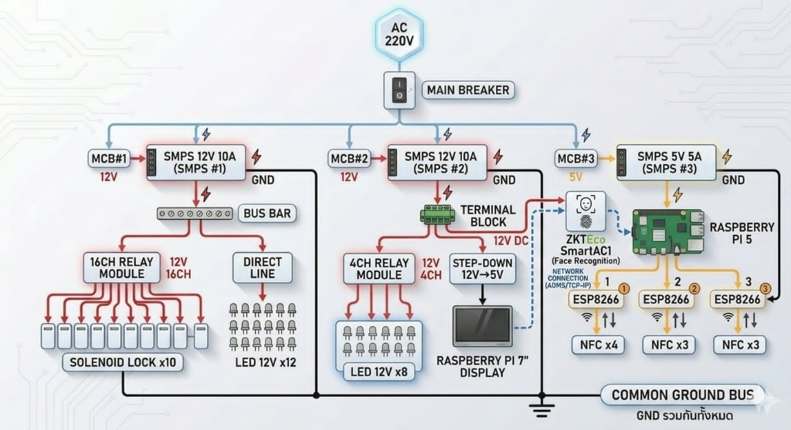

**ภาพที่ 3-26** แสดงแผนผังการกระจายพลังงานไฟฟ้าและการสื่อสารของระบบ KMS (System Power Distribution and Architecture) โดยรับไฟ AC 220V ผ่าน Main Breaker และแจกจ่ายขนานกันไปยัง Switching Power Supply (SMPS) จำนวน 3 ชุด เพื่อแยกโหลดการทำงานและป้องกันสัญญาณรบกวน ดังนี้ SMPS #1 (12V 10A) สำหรับจ่ายพลังงานให้กับชุด Relay Module และ Solenoid Lock รวมถึงชุดไฟแสดงผล SMPS #2 (12V 10A) จ่ายไฟให้กับอุปกรณ์ระบบทำงานรอง และ SMPS #3 (5V 5A) จ่ายไฟหล่อเลี้ยงให้กับอุปกรณ์ประมวลผลหลัก ได้แก่ Raspberry Pi 5 และบอร์ด ESP8266 ทั้ง 3 ชุด โดยมี Common Ground Bus เชื่อมต่อสายกราวด์ทุกชุดเข้าด้วยกันเพื่อป้องกันปัญหาการลอยตัวแรงดัน (Floating Voltage) หรือไฟตกกระชาก

ระบบ Hardware ประกอบด้วยอุปกรณ์หลัก 2 ชั้น ได้แก่ ชั้นควบคุมกลาง (Controller Layer)
บน Raspberry Pi 5 และชั้นอ่าน NFC (NFC Bridge Layer) บนบอร์ด ESP8266 เครื่อง ZKTeco
SmartAC1 จะทำหน้าที่สแกนใบหน้าและบัตรเพื่อสื่อสารกับ Backend ทันที

### 3.3.1 หลักการเชื่อมต่อแผงอ่านบัตร NFC (MFRC522)

เพื่อให้ระบบสามารถอ่านสถานะกุญแจได้ครบ 10 ช่อง ผู้วิจัยได้นำบอร์ด ESP8266 
มาเชื่อมต่อกับโมดูล MFRC522 หลายตัวผ่านสถาปัตยกรรม SPI Bus ดังแสดงในภาพที่ 3-27

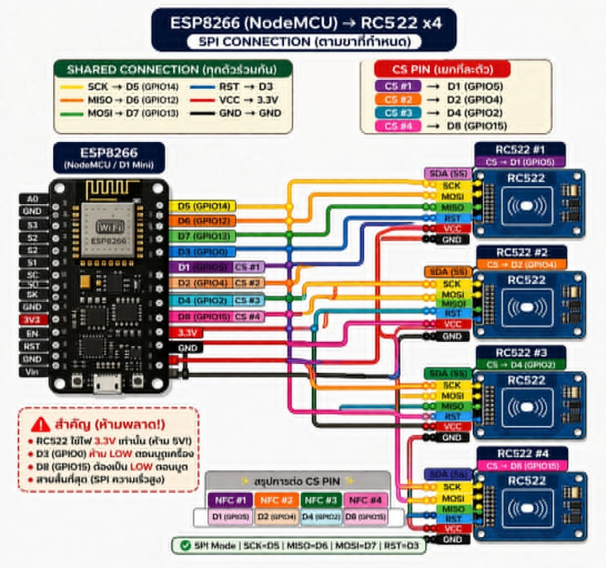

**ภาพที่ 3-27** แสดงการเชื่อมต่อระหว่างบอร์ด ESP8266 (NodeMCU) และโมดูลอ่าน NFC MFRC522 จำนวน 4 ชุด (สำหรับกลุ่ม 4 ช่องแรก) โดยอาศัยหลักการแชร์สายสัญญาณแบบ SPI ได้แก่ SCK (D5), MISO (D6) และ MOSI (D7) ร่วมกันทุกชุด สิ่งสำคัญคือการแยกสาย Chip Select (CS) ของเซนเซอร์แต่ละตัวไว้ที่พอร์ตที่แตกต่างกัน ได้แก่ D1, D2, D4 และ D8 เพื่อให้ ESP8266 สามารถสลับสถานะและสั่งงานให้อ่าน NFC ทีละช่องได้อย่างแม่นยำ โดยโมดูล MFRC522 ทั้งหมดทำงานที่ระดับแรงดันไฟ 3.3V เท่านั้น

Hardware Service (hardware.js) มอบหมายให้โปรแกรมทำงานแบบ NFC Polling อย่างต่อเนื่องทุก 200
มิลลิวินาที โดยส่งคำสั่งไปยัง ESP8266 ในรูปแบบ JSON ผ่านพอร์ต USB Serial เช่น
`{"cmd":"read","slot":1}` แล้ว ESP8266 จะตอบกลับด้วยผลการอ่าน เช่น `{"slot":1,"uid":"A1B2C3D4"}` 
หากไม่พบจะตอบกลับเป็นค่าว่าง เมื่อระบบตรวจพบการเปลี่ยนแปลงสถานะตู้กุญแจ 
จะทำการส่ง Socket Event กลับไปยังศูนย์กลาง Backend เพื่ออัปเดตระบบฐานข้อมูลทันที

### 3.3.2 หลักการทำงานและวงจรควบคุม Solenoid Lock

ส่วนของการควบคุมและรักษาความปลอดภัยของตู้กุญแจ ระบบใช้กลไกของกลอน Solenoid ชนิด DC 12V 
ซึ่งสั่งการผ่านโมดูลรีเลย์สัญญาณ (Relay Module) 16 Channel ดังแสดงในภาพที่ 3-28

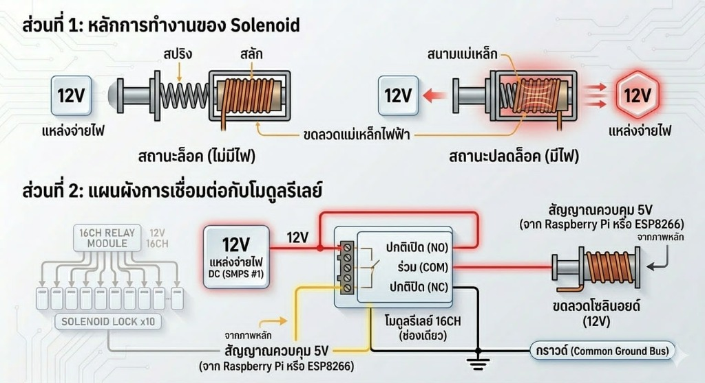

**ภาพที่ 3-28** แสดงหลักการทำงานและแผนผังวงจรควบคุมกลอนแม่เหล็ก (Solenoid Lock) 
ในสถานะปกติที่ไม่มีการจ่ายไฟ สปริงจะดันสลักยื่นออกเพื่อล็อกตู้กุญแจให้แน่นหนา
เมื่อผู้ใช้งานทำรายการเบิกกุญแจเสร็จสมบูรณ์ Raspberry Pi 5 จะส่งคำสั่งควบคุมกระแส 5V 
ไปยังช่อง Normally Open (NO) ของ Relay Module เพื่อให้ครบวงจรกับแหล่งจ่ายไฟ DC 12V
ในฝั่งของโหลดกลอนกระแสตรง กระแสไฟฟ้าที่ไหลเข้าสู่ขดลวด Solenoid 
จะเหนี่ยวนำให้เกิดสนามแม่เหล็กดึงสลักถอยหลัง ส่งผลให้ผู้ใช้สามารถดึงกุญแจออกได้

ระบบจะรอคอยการตอบสนองสูงสุด 10 วินาที เมื่อพบว่ากุญแจถูกดึงออกสำเร็จ
(โดยตรวจจาก NFC Tag ที่หายไปติดต่อกัน 3 ครั้งเพื่อป้องกันปัญหา False Trigger) 
ระบบจะสั่งตัดสัญญาณ ส่งผลให้ Solenoid สปริงตัวกลับและล็อกตู้กุญแจตามเดิม

### 3.3.3 หลักการทำงานของระบบไฟ LED แสดงสถานะ

ทุกช่องกุญแจมี LED 2 สี เชื่อมต่อกับ GPIO Pins ของ Raspberry Pi 5 โดยมีหลักการทำงานคือ
ไฟ LED สีเขียวแสดงเมื่อ NFC Tag ตรวจจับได้ หมายความว่ามีพวงกุญแจอยู่ในช่อง
ไฟ LED สีแดงแสดงเมื่อไม่มี NFC Tag หมายความว่าช่องว่างเนื่องจากกุญแจถูกเบิกออก 
และไฟ LED กระพริบสลับแดง-เขียวแสดงเมื่อระบบอยู่ในโหมดรอดำเนินการ 
เช่น ระหว่างรอผู้ใช้เสียบกุญแจคืนช่อง หรือรอดึงกุญแจออกหลังปลดล็อกแล้ว

### 3.3.4 หลักการทำงานของระบบยืนยันตัวตนด้วย ZKTeco SmartAC1

เครื่อง ZKTeco SmartAC1 ทำงานโดยใช้ ADMS Protocol ซึ่งเป็น HTTP Protocol
เฉพาะของ ZKTeco เมื่อผู้ใช้งานสแกนใบหน้า เครื่องจะส่ง HTTP POST ไปยัง 
`/adms/cdata` บน Backend Server จากนั้น Backend จะประมวลผลข้อมูลรหัสสมาชิก 
และส่งข้อมูลด้วย Socket Event `scan:received` ไปยัง Kiosk UI ต่อไป

### 3.3.5 ระบบ Auto-Recovery

เพื่อรองรับปัญหาทางกายภาพที่อาจเกิดขึ้นกะทันหัน เช่น ไฟตก หรือสาย USB หลุดหลวม
Hardware Service มีกลไกป้องกันตัวเพื่อ Auto-Recovery ดังนี้ (1) Watchdog Timer: 
ตรวจสอบ Polling Loop ทุก 5 วินาที หากบอร์ด ESP8266 นิ่งสนิทจะบังคับ Re-sync การเชื่อมต่อใหม่ 
(2) Dynamic Port Re-scan: หากพอร์ตหายไปจะแสกนหาใหม่ใน 30 วินาที 
และ (3) Guard Check Protection ป้องกันการส่งคำสั่ง Polling จำนวนมากเกินจนทำให้ Serial สื่อสารทับซ้อนกัน

---

## 3.4 ระยะที่ 4: การประเมินระบบ

การประเมินระบบ KMS แบ่งออกเป็น 6 ส่วน โดยอ้างอิงตามขอบเขตโครงงาน (บทที่ 1
ข้อ 1.3) มีจุดประสงค์เพื่อยืนยันว่าระบบทำงานได้ตามที่ออกแบบไว้ครบถ้วน ทั้งในส่วน
ของ Hardware Software Web Application ความถูกต้องของข้อมูล ประสิทธิภาพ และ
ฟีเจอร์เพิ่มเติม รวมทั้งหมด 74 กรณีทดสอบ

### 3.4.1 การทดสอบด้านฮาร์ดแวร์

การทดสอบด้านฮาร์ดแวร์อ้างอิงขอบเขต 1.3.1 มีจุดประสงค์เพื่อทดสอบว่าอุปกรณ์
ฮาร์ดแวร์ทุกชิ้นทำงานได้ถูกต้องและสื่อสารกันได้ตามที่ออกแบบไว้ ครอบคลุม NFC
Reader Relay Solenoid LED และ ESP8266 Boards กรณีทดสอบในส่วนนี้ประกอบด้วย
การอ่านบัตร NFC ทั้งแบบบัตร MIFARE Classic สมาร์ตโฟน Android iOS และการ
ปฏิเสธบัตรที่ไม่ได้ลงทะเบียน เพื่อตรวจสอบว่าระบบสามารถอ่าน UID ได้จากอุปกรณ์
หลายประเภทภายใน 2 วินาที การควบคุม Solenoid Lock เพื่อตรวจสอบว่า Solenoid
ปลดล็อกเมื่อเบิกและล็อกอัตโนมัติเมื่อดึงกุญแจออกหรือหมดเวลา การทดสอบระบบไฟ
LED เพื่อตรวจสอบว่า LED เปลี่ยนสีถูกต้องตามสถานะ และการทดสอบ ESP8266
Multi-Board เพื่อตรวจสอบว่าบอร์ดทั้ง 3 ถูกตรวจจับและ Auto-reconnect เมื่อหลุด
โดยมีกรณีทดสอบทั้งหมด 16 กรณีทดสอบ (HW-01 ถึง HW-16)

### 3.4.2 การทดสอบซอฟต์แวร์ระบบเบิกคืนกุญแจ

การทดสอบนี้อ้างอิงขอบเขต 1.3.2.1 ข) มีจุดประสงค์เพื่อทดสอบ Business Logic หลัก
ของระบบ ครอบคลุมทุกกรณีที่อาจเกิดขึ้นในการเบิกคืนกุญแจ กรณีทดสอบประกอบด้วย
การเบิกกุญแจตามตาราง (มีสิทธิ์) เพื่อตรวจสอบว่าระบบปลดล็อกทันทีโดยไม่ต้องกรอก
เหตุผล การเบิกกุญแจนอกตาราง (ต้องใส่เหตุผล) เพื่อตรวจสอบว่าระบบแสดงฟอร์ม
ให้กรอกเหตุผลก่อนเบิก การเบิกกุญแจล่วงหน้า 30 นาที เพื่อตรวจสอบว่าระบบอนุญาต
การเบิกล่วงหน้าตาม Policy การปฏิเสธเบิกเมื่อมีกุญแจค้างอยู่ เพื่อป้องกันการเบิกซ้ำ
โดยยังไม่คืนกุญแจเดิม การปฏิเสธเมื่อบัญชีถูกระงับ เพื่อตรวจสอบว่าผู้ใช้ที่คะแนนหมด
ไม่สามารถเบิกได้ การป้องกันคาบชน (Schedule Reserved) เพื่อตรวจสอบว่าห้องที่มีคน
มีเรียนอยู่ถูกสงวนสิทธิ์ตลอดคาบ การยกเลิกเมื่อไม่ดึงกุญแจภายใน 10 วินาที การ
คืนกุญแจทั้งตรงเวลาและล่าช้า การป้องกันการเสียบผิดช่อง Auto-Return เมื่อเสียบ
กุญแจโดยไม่กดเมนู และการหักคะแนนรวมถึงการ Ban ผู้ใช้เมื่อคะแนนเหลือ 0 โดยมี
กรณีทดสอบทั้งหมด 16 กรณีทดสอบ (SW-01 ถึง SW-16)

### 3.4.3 การทดสอบเว็บแอปพลิเคชัน

การทดสอบนี้อ้างอิงขอบเขต 1.3.2.1 และ 1.3.2.2 มีจุดประสงค์เพื่อทดสอบฟังก์ชัน
การจัดการระบบผ่านเว็บแอปพลิเคชันที่ใช้โดยเจ้าหน้าที่และอาจารย์ กรณีทดสอบ
ประกอบด้วย ระบบ Login และ Role Management ระบบจัดการข้อมูลผู้ใช้รวมถึงการ
นำเข้าจาก Excel ระบบแสดงสถานะกุญแจ Real-time ระบบจัดการตารางสอนและ
Sync DailyAuthorization ระบบโอนสลับสิทธิ์ผ่านหน้าเว็บ และการตรวจสอบประวัติ
Booking และ Penalty Log โดยมีกรณีทดสอบทั้งหมด 19 กรณีทดสอบ (WEB-01
ถึง WEB-19)

### 3.4.4 การทดสอบความถูกต้องของข้อมูล

การทดสอบนี้อ้างอิงขอบเขต 1.3.3 มีจุดประสงค์เพื่อตรวจสอบว่าข้อมูลทุกประเภทถูก
บันทึกลงฐานข้อมูลอย่างครบถ้วนและถูกต้อง กรณีทดสอบประกอบด้วย การตรวจสอบ
ว่า Booking record มีข้อมูล userId keyId borrowAt และ status=BORROWED ครบถ้วน
หลังเบิกสำเร็จ การตรวจสอบว่า Booking record มีข้อมูล returnAt lateMinutes และ
penaltyScore ครบถ้วนหลังคืนสำเร็จ การตรวจสอบความครบถ้วนของข้อมูลผู้ใช้และ
กุญแจ โดยมีกรณีทดสอบทั้งหมด 4 กรณีทดสอบ (DATA-01 ถึง DATA-04)

### 3.4.5 การทดสอบประสิทธิภาพ

การทดสอบนี้อ้างอิงขอบเขต 1.3.4.3 ก) มีจุดประสงค์เพื่อวัดและยืนยันว่าระบบมีความ
แม่นยำ ความเร็ว และความเสถียรเพียงพอสำหรับการใช้งานจริง โดยกำหนดเกณฑ์
การทดสอบดังนี้ ความแม่นยำในการอ่าน NFC กำหนดเกณฑ์ผ่านที่ไม่น้อยกว่าร้อยละ
95 จากการทดสอบ 50 ครั้ง ความเร็วตอบสนองตั้งแต่สแกนจนระบบแสดงผลต้องไม่เกิน
3 วินาที ความเร็วปลดล็อก Solenoid ต้องไม่เกิน 5 วินาที ความเร็วอัปเดตสถานะคืน
กุญแจต้องไม่เกิน 5 วินาที ความเร็วโหลดหน้า Web Dashboard ต้องไม่เกิน 5 วินาที
และความเสถียร (Uptime) ต้องไม่น้อยกว่าร้อยละ 99 ในระยะเวลา 24 ชั่วโมง โดยมี
กรณีทดสอบทั้งหมด 10 กรณีทดสอบ (PERF-01 ถึง PERF-10)

### 3.4.6 การทดสอบฟีเจอร์เพิ่มเติม

ฟีเจอร์เพิ่มเติมเป็นฟีเจอร์ที่ทีมพัฒนาออกแบบเพิ่มเติมนอกเหนือขอบเขตเดิม เพื่อแก้
ปัญหาที่พบในการใช้งานจริงและเพิ่มความน่าเชื่อถือของระบบ ประกอบด้วย ระบบ
Auto-Reconciliation หรือ Auto-Return เป็นฟีเจอร์ที่ระบบตรวจจับและปิด Booking
อัตโนมัติเมื่อเสียบกุญแจโดยไม่กดเมนู พัฒนาขึ้นเพื่อแก้ปัญหา Booking ค้างเมื่อ
ผู้ใช้ลืมกดคืน Reconcile Scan เป็นฟีเจอร์ตรวจสอบกุญแจทุกช่องก่อนแสดงรายการ
เบิก เพื่อป้องกันการแสดงห้องว่างที่ความจริงมีกุญแจอยู่แล้ว ระบบป้องกันการเสียบผิด
ช่องแจ้งเตือนทันทีเมื่อเสียบกุญแจผิดช่อง สิทธิ์พิเศษสำหรับครูและเจ้าหน้าที่ที่สามารถ
ข้ามการตรวจสอบ Schedule Conflict เพื่อรองรับการใช้งานฉุกเฉิน และระบบ Docker
Deployment ที่สามารถ Deploy ด้วย Docker Compose ได้อย่างสมบูรณ์ โดยมีกรณี
ทดสอบทั้งหมด 9 กรณีทดสอบ (EXT-01 ถึง EXT-09)

ผลการทดสอบทั้งหมดจะถูกรวบรวมและนำเสนอในบทที่ 4 ผลการวิเคราะห์ข้อมูล
พร้อมตารางสรุปผลที่แท้จริงของแต่ละกรณีทดสอบ
