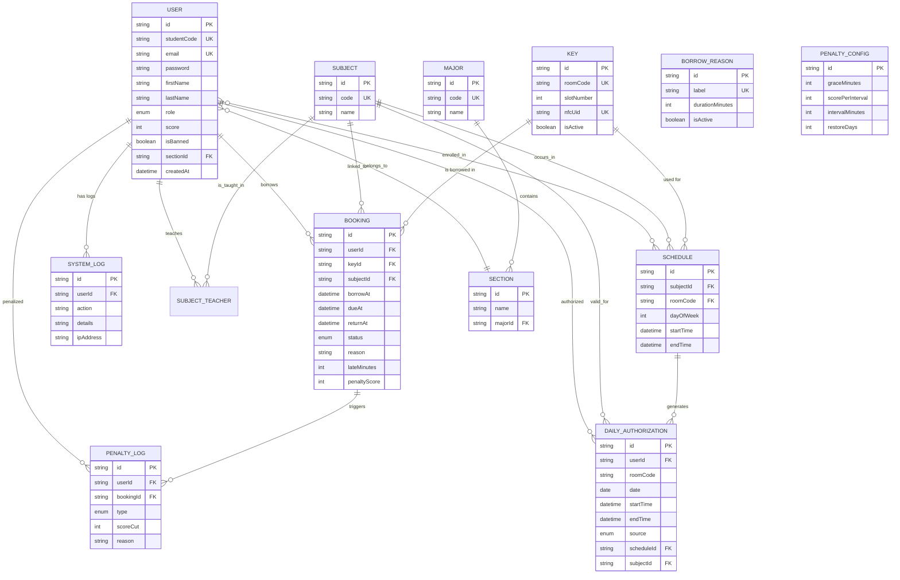

# ER Diagram — ระบบจัดการกุญแจ (KMS)

> ไฟล์นี้ใช้อ้างอิงใน `text.md` ของ Phase 1 ส่วน Entity Relationship Diagram

## ความสัมพันธ์สำคัญ

| ความสัมพันธ์ | คำอธิบาย |
|---|---|
| User → Booking | ผู้ใช้หนึ่งคนสามารถมีรายการเบิกได้หลายรายการ แต่การเบิกแต่ละครั้งเป็นของผู้ใช้คนเดียว |
| Key → Booking | กุญแจหนึ่งดอกสามารถถูกเบิกได้หลายครั้ง (ต่างเวลากัน) |
| Schedule → DailyAuthorization | ตารางสอนประจำสัปดาห์จะถูกแปลงเป็น DailyAuthorization ทุกวัน |
| Booking → PenaltyLog | เมื่อคืนกุญแจช้า ระบบจะสร้างบันทึกการหักคะแนนโดยอัตโนมัติ |
| DailyAuthorization | ตาราง "ต้นฉบับความจริง" ที่ระบบใช้ตรวจสอบสิทธิ์เบิกกุญแจในแต่ละวัน |
