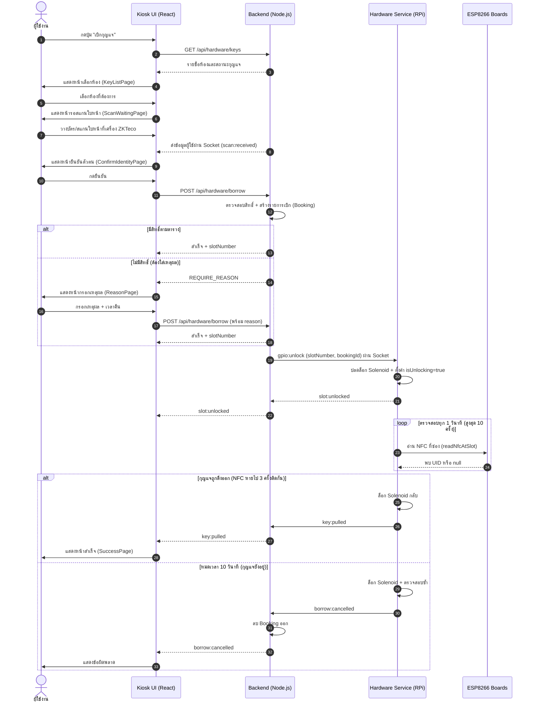
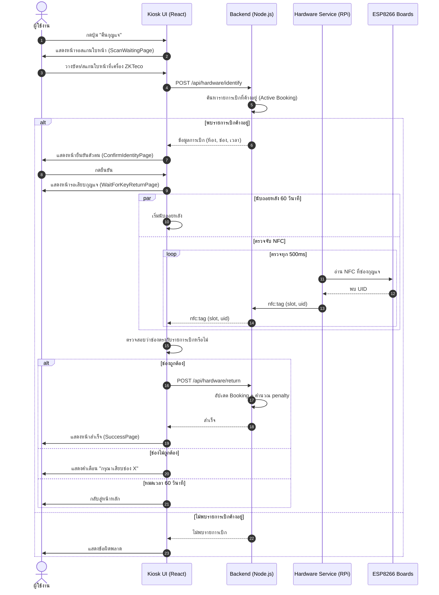
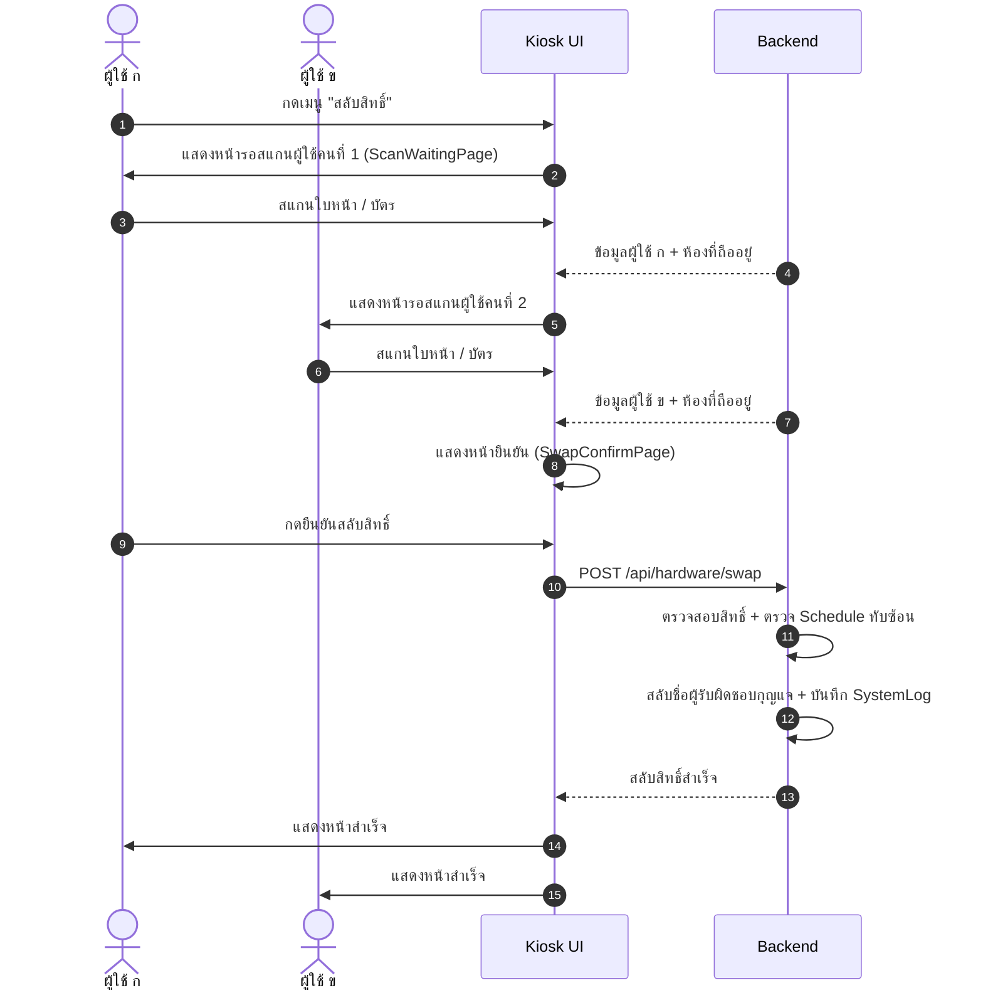
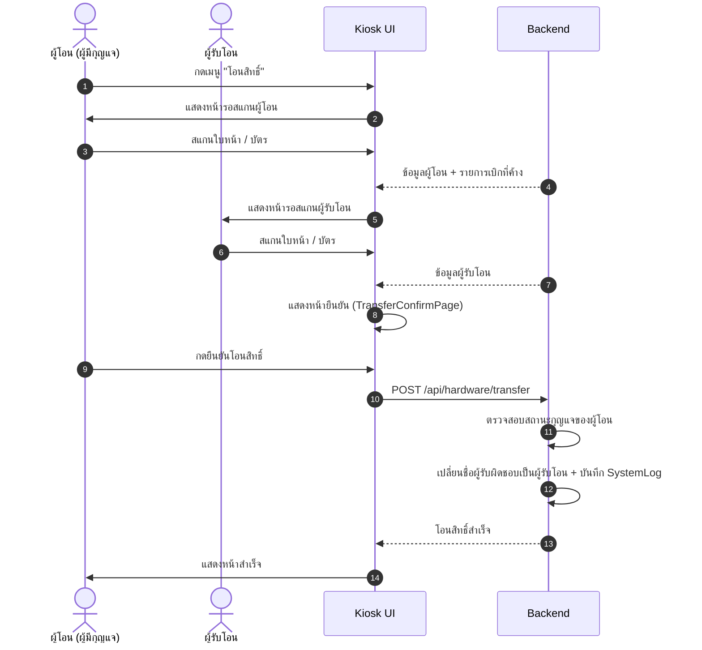
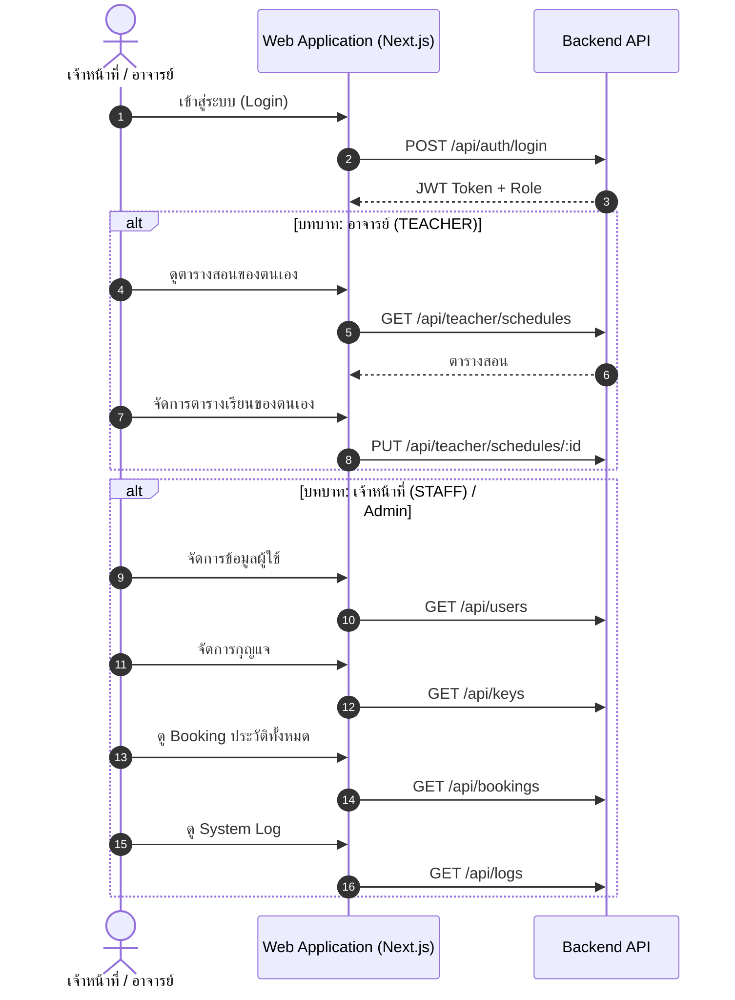

# Sequence Diagrams — ระบบจัดการกุญแจ (KMS)

> ไฟล์นี้ใช้อ้างอิงใน `text.md` ของ Phase 1 ส่วน Sequence Diagrams

---

## 1. ลำดับการทำงาน: การเบิกกุญแจ (Borrow Key)

---

## 2. ลำดับการทำงาน: การคืนกุญแจ (Return Key)

---

## 3. ลำดับการทำงาน: การสลับสิทธิ์กุญแจ (Swap Authorization)

---

## 4. ลำดับการทำงาน: การโอนสิทธิ์กุญแจ (Transfer Authorization)

---

## 5. ลำดับการทำงาน: เจ้าหน้าที่/อาจารย์ (Staff/Teacher Web System)

