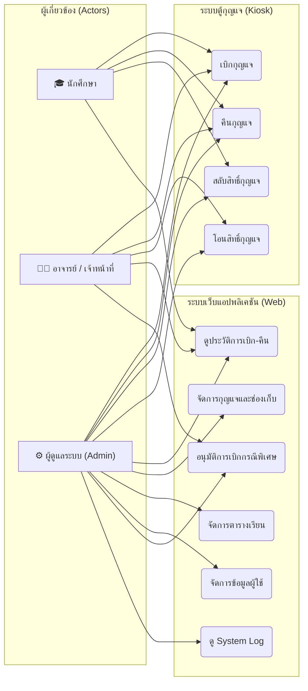

# Use Case Diagram — ระบบจัดการกุญแจ (KMS)

> ไฟล์นี้ใช้อ้างอิงใน `text.md` ของ Phase 1 ส่วน Use Case Diagram

## Use Case Diagram (ภาพรวม)

## ตารางสรุปสิทธิ์การใช้งาน

| ฟังก์ชัน | นักศึกษา | อาจารย์ | เจ้าหน้าที่/Admin |
|---|:---:|:---:|:---:|
| เบิกกุญแจ (ตามตาราง) | ✅ | ✅ | ✅ |
| เบิกกุญแจ (นอกตาราง ต้องใส่เหตุผล) | ✅ | ✅ (ไม่ต้องใส่เหตุผล) | ✅ (ไม่ต้องใส่เหตุผล) |
| คืนกุญแจ | ✅ | ✅ | ✅ |
| สลับสิทธิ์กุญแจ (Swap) | ✅ | ❌ | ✅ |
| โอนสิทธิ์กุญแจ (Transfer) | ❌ | ✅ | ✅ |
| จัดการตารางเรียน | ❌ | ✅ (เฉพาะวิชาตัวเอง) | ✅ |
| จัดการข้อมูลผู้ใช้ | ❌ | ❌ | ✅ |
| ดู System Log | ❌ | ❌ | ✅ |
