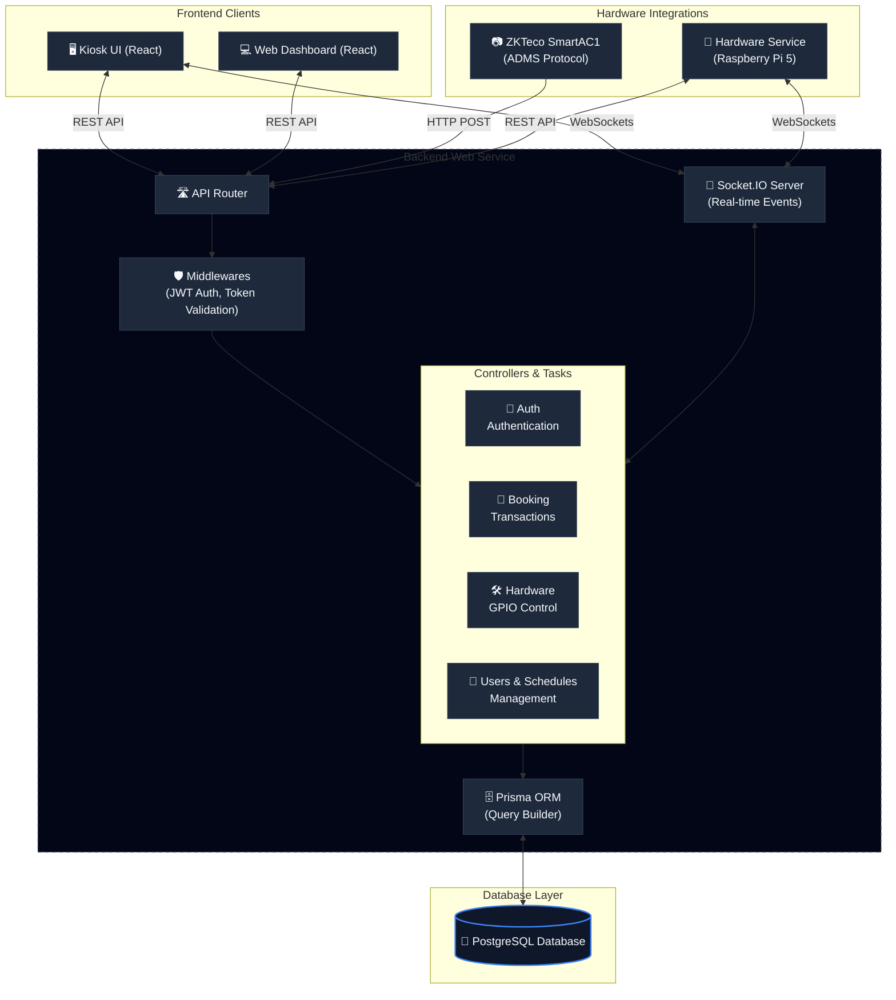

# Backend Architecture Diagram

```mermaid
flowchart TD
    subgraph FrontendClients [Frontend Clients]
        Kiosk["🖥️ Kiosk UI (React)"]
        WebDash["💻 Web Dashboard (React)"]
    end

    subgraph HardwareClients [Hardware Integrations]
        ZKTeco["📷 ZKTeco SmartAC1<br/>(ADMS Protocol)"]
        RPI["🍓 Hardware Service<br/>(Raspberry Pi 5)"]
    end

    subgraph BackendWebservice [Backend Web Service]
        Router["🛣️ API Router"]
        
        Middleware["🛡️ Middlewares<br/>(JWT Auth, Token Validation)"]
        
        SocketIO["🔌 Socket.IO Server<br/>(Real-time Events)"]
        
        subgraph Controllers [Controllers & Tasks]
            AuthController["🔑 Auth<br/>Authentication"]
            BookingController["📅 Booking<br/>Transactions"]
            HardwareController["🛠️ Hardware<br/>GPIO Control"]
            UserController["👤 Users & Schedules<br/>Management"]
        end
        
        Prisma["🗄️ Prisma ORM<br/>(Query Builder)"]
    end

    subgraph DatabaseLayer [Database Layer]
        Postgres[("🐘 PostgreSQL Database")]
    end

    Kiosk <-->|REST API| Router
    Kiosk <-->|WebSockets| SocketIO
    WebDash <-->|REST API| Router

    ZKTeco -->|HTTP POST| Router
    RPI <-->|REST API| Router
    RPI <-->|WebSockets| SocketIO

    Router --> Middleware
    Middleware --> Controllers
    SocketIO <--> Controllers

    Controllers --> Prisma
    Prisma <--> Postgres

    classDef default fill:#1e293b,stroke:#334155,stroke-width:1px,color:#f8fafc;
    classDef highlight fill:#3b82f6,stroke:#2563eb,stroke-width:2px,color:#ffffff;
    classDef database fill:#0f172a,stroke:#3b82f6,stroke-width:2px,color:#f8fafc;
    classDef backendbox fill:#020617,stroke:#64748b,stroke-width:1px,stroke-dasharray: 5 5;
    
    class Postgres database;
    class BackendWebservice backendbox;
```
