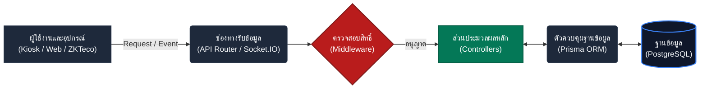

# Backend Workflow

```mermaid
flowchart LR
    A["ผู้ใช้งานและอุปกรณ์\n(Kiosk / Web / ZKTeco)"] -->|Request / Event| B("ช่องทางรับข้อมูล\n(API Router / Socket.IO)")
    B --> C{"ตรวจสอบสิทธิ์\n(Middleware)"}
    C -->|อนุญาต| D["ส่วนประมวลผลหลัก\n(Controllers)"]
    D <--> E("ตัวควบคุมฐานข้อมูล\n(Prisma ORM)")
    E <--> F[("ฐานข้อมูล\n(PostgreSQL)")]

    classDef default fill:#1e293b,stroke:#334155,stroke-width:1px,color:#f8fafc;
    classDef auth fill:#b91c1c,stroke:#7f1d1d,stroke-width:2px,color:#ffffff;
    classDef logic fill:#047857,stroke:#065f46,stroke-width:2px,color:#ffffff;
    classDef db fill:#0f172a,stroke:#3b82f6,stroke-width:2px,color:#f8fafc;
    
    class C auth;
    class D logic;
    class F db;
```
