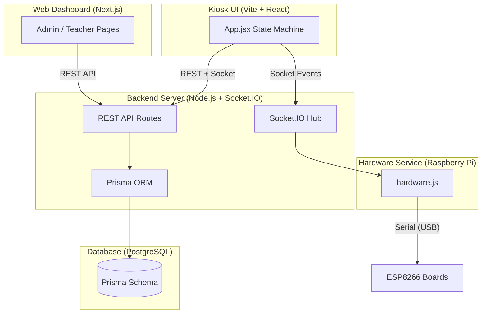
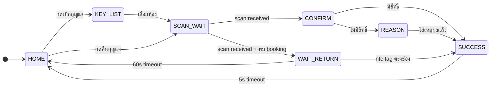

# Phase 2: การพัฒนาซอฟต์แวร์ (Software Development)
## บทที่ 3 — การออกแบบและพัฒนาระบบจัดการกุญแจ (KMS)

---

## 2.1 ภาพรวมสถาปัตยกรรมซอฟต์แวร์

ระบบซอฟต์แวร์ของ KMS แบ่งออกเป็น 3 ส่วนหลัก:

1. **Kiosk UI** — แอปพลิเคชันสำหรับตู้กุญแจ พัฒนาด้วย React (Vite) ทำหน้าที่รับ input จากผู้ใช้ที่หน้าตู้
2. **Web Frontend** — เว็บแอปพลิเคชันสำหรับเจ้าหน้าที่และอาจารย์ พัฒนาด้วย Next.js ใช้จัดการข้อมูลผ่าน Browser
3. **Backend API** — เซิร์ฟเวอร์ Node.js ที่จัดการ Business Logic, ฐานข้อมูล (Prisma + PostgreSQL), และการสื่อสาร Real-time ผ่าน Socket.IO

---

## 2.2 ส่วนที่ 1: Kiosk UI (ตู้กุญแจ)

ระบบ Kiosk UI พัฒนาด้วย **React + Vite** ทำงานบน Raspberry Pi ที่เชื่อมต่อกับจอแสดงผล Touch Screen ใช้สถาปัตยกรรมแบบ **State Machine** ใน `App.jsx` เพื่อควบคุมการเปลี่ยนหน้าจออย่างเป็นระเบียบ

### 2.2.1 โครงสร้าง Routes และหน้าของ Kiosk UI

| หน้า (Page) | ไฟล์ | หน้าที่ |
|---|---|---|
| **หน้าหลัก** | `HomePage.jsx` | แสดงเมนูหลัก: เบิกกุญแจ, คืนกุญแจ, สลับสิทธิ์, โอนสิทธิ์ |
| **เลือกห้อง** | `KeyListPage.jsx` | แสดงรายการกุญแจทั้งหมดพร้อมสถานะ (ว่าง/ถูกเบิก) แบบ Real-time |
| **รอสแกนบัตร** | `ScanWaitingPage.jsx` | แสดงหน้ารอรับข้อมูลจากเครื่อง ZKTeco SmartAC1 ผ่าน Socket Event `scan:received` |
| **ยืนยันตัวตน** | `ConfirmIdentityPage.jsx` | แสดงรูปและข้อมูลผู้ใช้ที่สแกนมาได้ ให้ผู้ใช้ยืนยัน |
| **กรอกเหตุผล** | `ReasonPage.jsx` | แสดงฟอร์มให้กรอกเหตุผลและเวลาคืน (สำหรับผู้ไม่มีสิทธิ์ตามตาราง) |
| **รอคืนกุญแจ** | `WaitForKeyReturnPage.jsx` | รอสัญญาณ NFC จาก ESP8266 ว่าเสียบกุญแจแล้ว พร้อมนับถอยหลัง 60 วินาที |
| **สำเร็จ** | `SuccessPage.jsx` | แสดงผลสำเร็จ + นับถอยหลัง 5 วินาทีก่อนกลับหน้าหลัก |
| **ยืนยันสลับสิทธิ์** | `SwapConfirmPage.jsx` | แสดงข้อมูลทั้ง 2 คนที่จะสลับห้อง ก่อนยืนยัน |
| **ยืนยันโอนสิทธิ์** | `TransferConfirmPage.jsx` | แสดงข้อมูลผู้โอนและผู้รับก่อนยืนยัน |
| **ยืนยันย้ายห้อง** | `MoveConfirmPage.jsx` | แสดงข้อมูลการย้ายห้องของผู้ใช้เอง ก่อนยืนยัน |

### 2.2.2 State Machine และ Flow การทำงาน

`App.jsx` ทำหน้าที่เป็น State Machine หลัก ควบคุมว่าหน้าใดควรแสดงในแต่ละสถานการณ์ โดยรับ Socket Events จาก Backend และอัปเดต State ตามลำดับ ดังนี้:

---

## 2.3 ส่วนที่ 2: Backend Web Service

Backend พัฒนาด้วย **Node.js + Express.js** ใช้ **Prisma ORM** สำหรับจัดการฐานข้อมูล **PostgreSQL** และ **Socket.IO** สำหรับการสื่อสาร Real-time ระหว่างตู้กุญแจ, ระบบเว็บ, และ Hardware Service

### 2.3.1 API Routes สำหรับ Kiosk / Hardware

> ทุก route ในกลุ่มนี้ต้องใช้ **HARDWARE_TOKEN** ในการยืนยันตัวตน

| Method | Route | หน้าที่ |
|:---:|---|---|
| GET | `/api/hardware/keys` | ดึงรายชื่อกุญแจทั้งหมดพร้อมสถานะ (ว่าง/ถูกเบิก) |
| GET | `/api/hardware/room-status` | ดูสถานะกุญแจแยกรายห้อง |
| POST | `/api/hardware/identify` | ระบุตัวตนผู้ใช้จากข้อมูลที่เครื่อง ZKTeco ส่งมา |
| GET | `/api/hardware/user/:code/status` | ตรวจสอบสถานะผู้ใช้ (Ban, Active Booking) |
| POST | `/api/hardware/borrow` | ทำรายการเบิกกุญแจ (พร้อมตรวจสิทธิ์ตาราง) |
| POST | `/api/hardware/return` | ทำรายการคืนกุญแจ (คำนวณ penalty อัตโนมัติ) |
| POST | `/api/hardware/swap` | สลับสิทธิ์กุญแจระหว่าง 2 ผู้ใช้ |
| POST | `/api/hardware/check-swap-eligibility` | ตรวจสอบว่าทั้ง 2 คนสามารถสลับได้หรือไม่ |
| POST | `/api/hardware/transfer` | โอนสิทธิ์กุญแจจากผู้โอนไปผู้รับ |
| POST | `/api/hardware/check-transfer-eligibility` | ตรวจสอบความพร้อมก่อนโอนสิทธิ์ |
| POST | `/api/hardware/move` | ย้ายสิทธิ์ห้อง (คนเดิม เปลี่ยนห้อง) |

### 2.3.2 API Routes สำหรับระบบ Socket (Real-time)

การสื่อสาร Real-time ระหว่าง Kiosk UI, Backend, และ Hardware ใช้ **Socket.IO Events** ดังนี้:

| Socket Event | ทิศทาง | คำอธิบาย |
|---|---|---|
| `scan:received` | Backend → UI | ส่งข้อมูลผู้ใช้หลังสแกนใบหน้าจาก ZKTeco |
| `gpio:unlock` | Backend → Hardware | สั่งปลดล็อก Solenoid ที่ช่องกุญแจที่ระบุ |
| `slot:unlocked` | Hardware → Backend → UI | ยืนยันว่า Solenoid ปลดล็อกสำเร็จ |
| `key:pulled` | Hardware → Backend → UI | แจ้งว่ากุญแจถูกดึงออกจากช่องแล้ว |
| `borrow:cancelled` | Hardware → Backend → UI | แจ้งยกเลิกการเบิก (หมดเวลา 10 วินาที) |
| `nfc:tag` | Hardware → Backend → UI | ส่ง UID ของ NFC Tag พร้อมหมายเลขช่องที่ตรวจพบ |
| `key:return` | UI → Backend | รับคำสั่งคืนกุญแจจาก Kiosk UI |
| `key:transfer` | UI → Backend | รับคำสั่งโอนสิทธิ์กุญแจ |
| `key:swap` | UI → Backend | รับคำสั่งสลับสิทธิ์กุญแจ |
| `key:move` | UI → Backend | รับคำสั่งย้ายห้องกุญแจ |
| `led:success` | Backend → Hardware | สั่งให้ไฟ LED กระพริบสีเขียว (สำเร็จ) |
| `led:error` | Backend → Hardware | สั่งให้ไฟ LED กระพริบสีแดง (ผิดพลาด) |
| `led:blink-return` | Backend → Hardware | สั่งให้ไฟ LED กระพริบสลับ (รอคืนกุญแจ) |

### 2.3.3 API Routes สำหรับ ZKTeco SmartAC1 (ADMS Protocol)

เครื่องสแกนใบหน้า ZKTeco SmartAC1 ส่งข้อมูล attendance มายัง Backend ผ่าน **ADMS Protocol** (HTTP GET/POST) ดังนี้

| Method | Route | หน้าที่ |
|:---:|---|---|
| ALL | `/adms/cdata` | รับข้อมูล Attendance (face scan) จากเครื่อง ZKTeco แบบ Raw Text และส่งต่อสัญญาณผ่าน Socket |
| POST | `/adms/registry` | รับการลงทะเบียนเครื่อง ZKTeco เมื่อเปิดเครื่องครั้งแรก |
| GET | `/adms/getrequest` | เครื่อง ZKTeco เรียก polling เพื่อรอคำสั่งจาก Server |

### 2.3.4 API Routes สำหรับ Admin / Web Dashboard

| Method | Route | หน้าที่ |
|:---:|---|---|
| POST | `/api/auth/login` | เข้าสู่ระบบ (รับ JWT Token) |
| GET | `/api/users` | ดูรายชื่อผู้ใช้ทั้งหมด |
| POST | `/api/users` | เพิ่มผู้ใช้ใหม่ (Admin) |
| GET | `/api/keys` | ดูรายชื่อกุญแจ |
| POST | `/api/keys` | เพิ่มกุญแจใหม่ |
| GET | `/api/bookings` | ดูรายการเบิก-คืนทั้งหมด |
| GET | `/api/schedules` | ดูตารางเรียนทั้งหมด |
| POST | `/api/schedules` | สร้างตารางเรียนใหม่ |
| GET | `/api/authorizations` | ดู DailyAuthorization ของวันนี้ |
| GET | `/api/statistics` | ดูสถิติการใช้งานระบบ |
| POST | `/api/student-import` | นำเข้าข้อมูลนักศึกษาจากไฟล์ Excel |
| GET | `/api/penalty` | ดูประวัติการหักคะแนน |

---

## 2.4 ส่วนที่ 3: Web Frontend (Next.js — Admin / Teacher)

เว็บแอปพลิเคชันสำหรับเจ้าหน้าที่และอาจารย์พัฒนาด้วย **Next.js** มี Route หลักดังต่อไปนี้

### สำหรับเจ้าหน้าที่ / Admin

| Route | หน้าที่ |
|---|---|
| `/dashboard` | หน้า Dashboard แสดงสถานะกุญแจ Real-time และสรุปการใช้งาน |
| `/keys` | จัดการกุญแจทั้งหมด (เพิ่ม, แก้ไข, ปิดใช้งาน) |
| `/users` | จัดการข้อมูลผู้ใช้ทั้งหมด (เพิ่ม, แก้ไข, Ban) |
| `/bookings` | ดูประวัติการเบิก-คืนกุญแจทั้งหมด |
| `/schedules` | จัดการตารางสอน (สร้าง, แก้ไข, นำเข้าจาก Excel) |
| `/authorizations` | ดู DailyAuthorization ของแต่ละวัน |
| `/penalty` | ดูและจัดการประวัติการหักคะแนน |
| `/logs` | ดู System Log ทั้งหมด |
| `/statistics` | ดูสถิติการใช้งานระบบ |

### สำหรับอาจารย์ (Teacher)

| Route | หน้าที่ |
|---|---|
| `/teacher/dashboard` | หน้า Overview แสดงตารางสอนประจำสัปดาห์ |
| `/teacher/schedules` | ดูและจัดการตารางสอนของตนเอง |
| `/teacher/bookings` | ดูประวัติการเบิก-คืนที่เกี่ยวข้องกับห้องของตน |

---

## 2.5 สรุป

ระบบซอฟต์แวร์ KMS ออกแบบในแบบ **Microservice-like Architecture** โดยแต่ละส่วนมีหน้าที่ชัดเจนและสื่อสารกันผ่าน REST API และ Socket.IO การใช้ Socket.IO ช่วยให้ระบบสามารถอัปเดตสถานะแบบ Real-time ได้ทั้ง Kiosk UI, Admin Dashboard, และ Hardware Service ทำให้ประสบการณ์ผู้ใช้ราบรื่นและข้อมูลถูกต้องตรงเวลา
