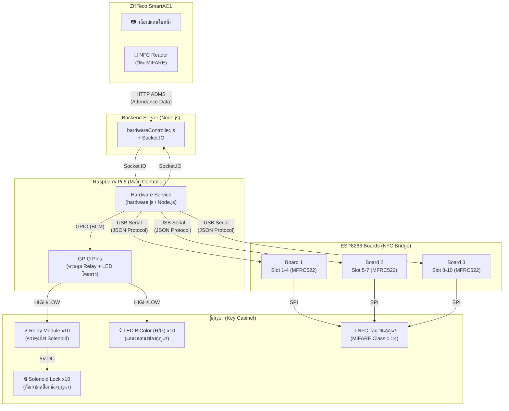
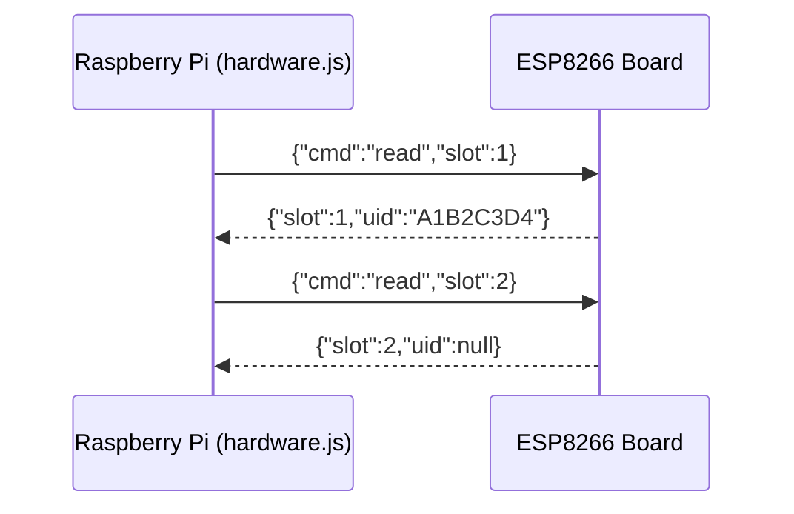

# Hardware Architecture Diagram — ระบบจัดการกุญแจ (KMS)

> ไฟล์นี้ใช้อ้างอิงใน `text.md` ของ Phase 3 ส่วนสถาปัตยกรรม Hardware

## ภาพรวมการเชื่อมต่อระบบ Hardware



---

## ตารางการกำหนด GPIO Pins บน Raspberry Pi

| บอร์ด | ช่อง (Slot) | GPIO Relay Pin | GPIO LED Pin (Red) |
|---|---|---|---|
| ESP8266 Board 1 | Slot 1 | GPIO 17 | GPIO 27 |
| ESP8266 Board 1 | Slot 2 | GPIO 22 | GPIO 23 |
| ESP8266 Board 1 | Slot 3 | GPIO 24 | GPIO 25 |
| ESP8266 Board 1 | Slot 4 | GPIO 5 | GPIO 6 |
| ESP8266 Board 2 | Slot 5 | GPIO 13 | GPIO 19 |
| ESP8266 Board 2 | Slot 6 | GPIO 26 | GPIO 16 |
| ESP8266 Board 2 | Slot 7 | GPIO 20 | GPIO 21 |
| ESP8266 Board 3 | Slot 8 | GPIO 12 | GPIO 7 |
| ESP8266 Board 3 | Slot 9 | GPIO 8 | GPIO 11 |
| ESP8266 Board 3 | Slot 10 | GPIO 9 | GPIO 10 |

---

## โปรโตคอล Serial JSON ระหว่าง RPi และ ESP8266



**รูปแบบคำสั่ง (Request):**
```json
{ "cmd": "read", "slot": 1 }
```

**รูปแบบผลลัพธ์ (Response):**
```json
{ "slot": 1, "uid": "A1B2C3D4" }
```
