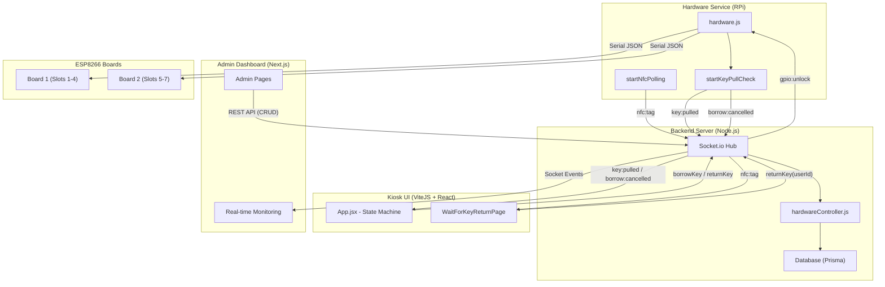

# KMS Communication Architecture

This diagram details the real-time communication flows between the Hardware, Backend, and Frontend of the Key Management System.

## Communication Summary

1.  **Frontend → Backend**: 
    -   React pages (`App.jsx`, `WaitForKeyReturnPage`) use **REST** and **Sockets** to trigger actions (`borrowKey`, `returnKey`).
2.  **Backend → Hardware**: 
    -   The `Socket.io Hub` sends `gpio:unlock` events to the RPi service (`hardware.js`).
3.  **Hardware → ESP8266**: 
    -   The RPi service uses **Serial JSON** to communicate with the multiple ESP8266 boards controlling the slots.
4.  **Hardware Feedback → Frontend**: 
    -   Real-time events like `nfc:tag`, `key:pulled`, and `borrow:cancelled` traverse from the hardware through the backend sockets back to the React UI for immediate state changes.
