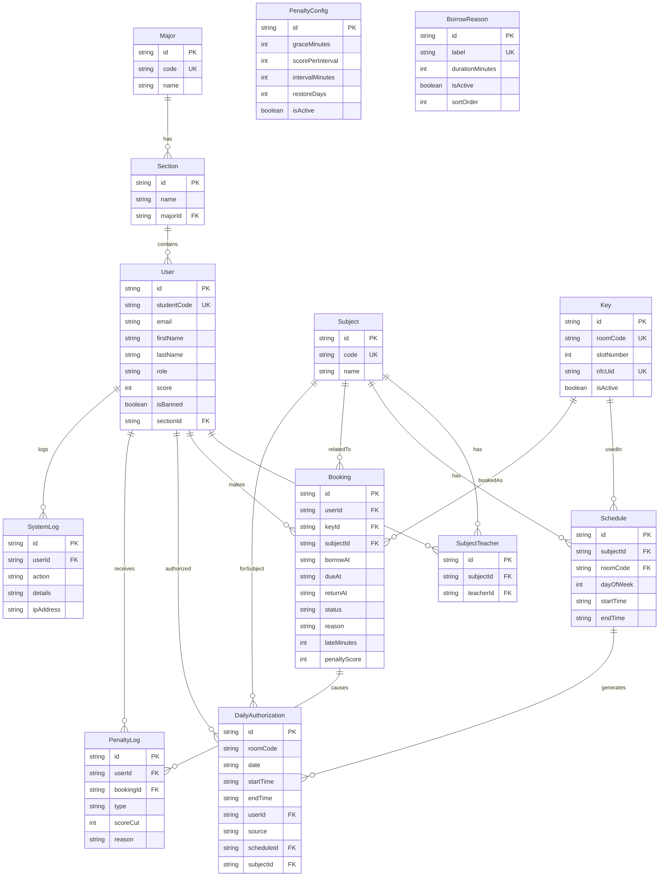

# KMS — Entity Relationship Diagram

> Database schema for the Key Management System (PostgreSQL + Prisma)

---

## ER Diagram

---

## Relationships

| From | To | Type | Description |
|---|---|---|---|
| Major | Section | 1:N | Major has many sections |
| Section | User | 1:N | Section contains many users |
| Subject | SubjectTeacher | 1:N | Subject taught by teachers |
| User | SubjectTeacher | 1:N | Teacher teaches subjects |
| Subject | Schedule | 1:N | Subject has schedules |
| Key | Schedule | 1:N | Key room used in schedules |
| User | Booking | 1:N | User makes bookings |
| Key | Booking | 1:N | Key booked in bookings |
| Subject | Booking | 1:N | Booking related to subject |
| User | DailyAuthorization | 1:N | User has daily authorizations |
| Schedule | DailyAuthorization | 1:N | Schedule generates authorizations |
| User | PenaltyLog | 1:N | User receives penalties |
| Booking | PenaltyLog | 1:N | Booking causes penalties |
| User | SystemLog | 1:N | User actions logged |

---

## Enums

| Enum | Values | Description |
|---|---|---|
| Role | STUDENT, TEACHER, STAFF, ADMIN | User roles |
| BookingStatus | BORROWED, RETURNED, LATE, RESERVED | Booking lifecycle |
| PenaltyType | LATE_RETURN, MANUAL | Penalty categories |
| AuthSource | SCHEDULE, MANUAL | Authorization origin |
