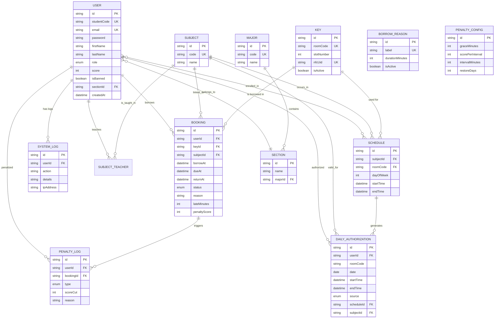

# KMS Entity Relationship Diagram (ERD)

This diagram represents the database structure of the Key Management System (KMS), supporting key borrowing, schedule-aware authorizations, and penalty tracking.

## Key Relationships
- **User & Booking**: A user can have multiple bookings (borrow logs), but each booking belongs to one user.
- **Key & Schedule**: A physical key is associated with a roomCode, which is used in schedules to identify where classes occur.
- **DailyAuthorization**: This table is the "Source of Truth" for who can borrow what key at what time. It is populated either automatically from `Schedule` or manually by staff.
- **Penalty Logic**: When a `Booking` is returned late, a `PenaltyLog` is created, and the `User.score` is updated based on `PenaltyConfig`.
