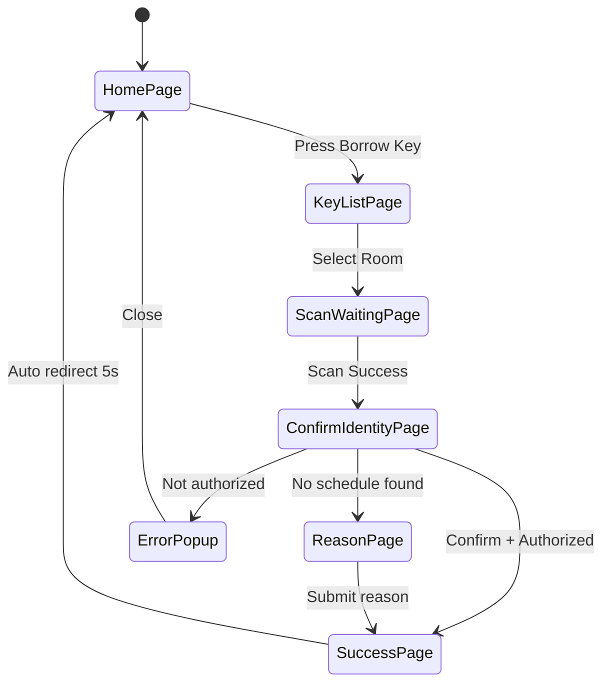
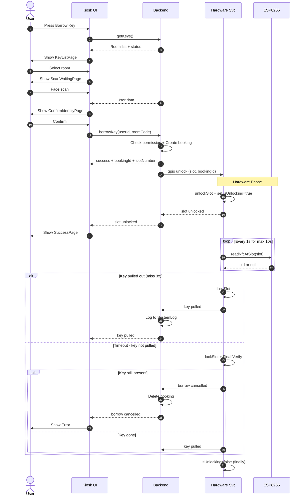
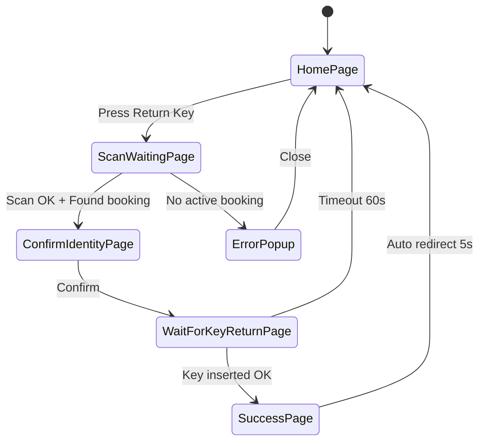
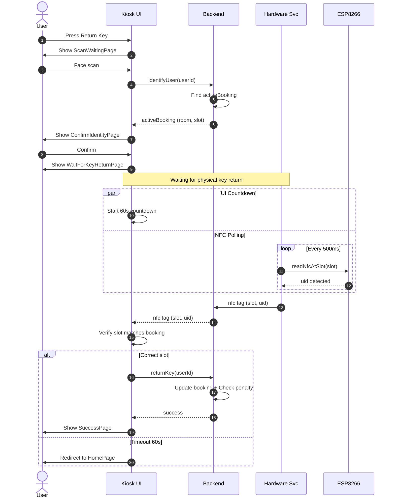
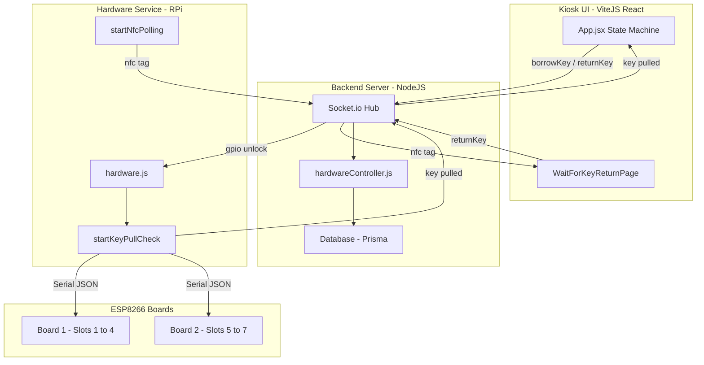

# KMS — Flow Diagrams (Borrow & Return)

> Borrow and Return key flow diagrams for the Key Management System.

---

## 1. Borrow Flow (ระบบเบิกกุญแจ)

### 1.1 UI State Machine

### 1.2 System Sequence

---

## 2. Return Flow (ระบบคืนกุญแจ)

### 2.1 UI State Machine

### 2.2 System Sequence

---

## 3. Communication Architecture

---

## 4. Socket Events

| Event | Direction | Description |
|---|---|---|
| `gpio:unlock` | Backend to HW | Unlock solenoid |
| `slot:unlocked` | HW to Backend to UI | Confirm unlocked |
| `key:pulled` | HW to Backend to UI | Key removed successfully |
| `borrow:cancelled` | HW to Backend to UI | Timeout, borrow cancelled |
| `nfc:tag` | HW to Backend to UI | NFC tag detected at slot |
| `scan:received` | Backend to UI | Face scan result |
| `key:return` | UI to Backend | Return key command |
| `key:transfer` | UI to Backend | Transfer authorization |
| `key:swap` | UI to Backend | Swap authorization |
| `key:move` | UI to Backend | Move room |
