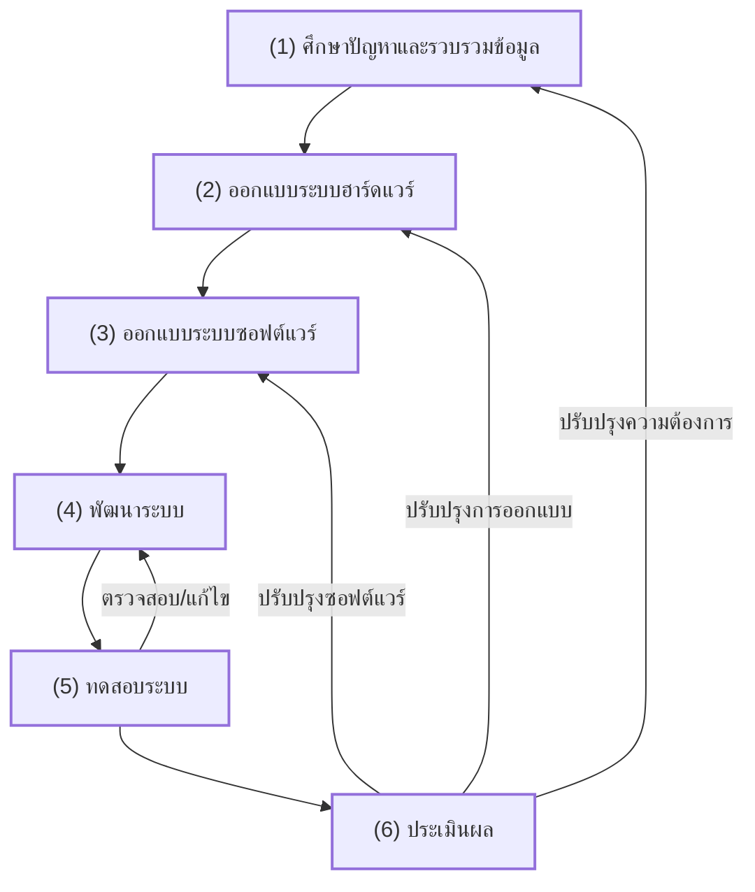

# 3. ขั้นตอนการดำเนินงาน (Project Methodology)

ภาพที่ 3-1 แสดงขั้นตอนการดำเนินงานที่ประกอบด้วย 6 ขั้นตอนหลัก ได้แก่ (1) ศึกษาปัญหาและรวบรวมข้อมูล (2) ออกแบบระบบฮาร์ดแวร์ (3) ออกแบบระบบซอฟต์แวร์ (4) พัฒนาระบบ (5) ทดสอบระบบ และ (6) ประเมินผล โดยแต่ละขั้นตอนมีความเชื่อมโยงกันและมีกระบวนการตรวจสอบย้อนกลับเพื่อปรับปรุงคุณภาพของระบบอย่างต่อเนื่อง

## รายละเอียดแต่ละขั้นตอน
1.  **ศึกษาปัญหาและรวบรวมข้อมูล**: วิเคราะห์ปัญหาการจัดการกุญแจในปัจจุบัน และรวบรวมความต้องการจากผู้ใช้งาน
2.  **ออกแบบระบบฮาร์ดแวร์**: ออกแบบวงจร การวางตำแหน่ง NFC Reader และระบบกลไกการล็อค
3.  **ออกแบบระบบซอฟต์แวร์**: ออกแบบโครงสร้างฐานข้อมูล (ER) และสถาปัตยกรรมการสื่อสาร (Socket/REST)
4.  **พัฒนาระบบ**: การเขียนโค้ดทั้งในส่วน Web, Kiosk UI และ ESP8266 Firmware
5.  **ทดสอบระบบ**: ทดสอบการทำงานร่วมกันระหว่าง Hardware และ Software (Unit Test/Integration Test)
6.  **ประเมินผล**: สรุปผลการทำงาน ตรวจสอบความพึงพอใจ และปรับปรุงตามข้อเสนอแนะ
