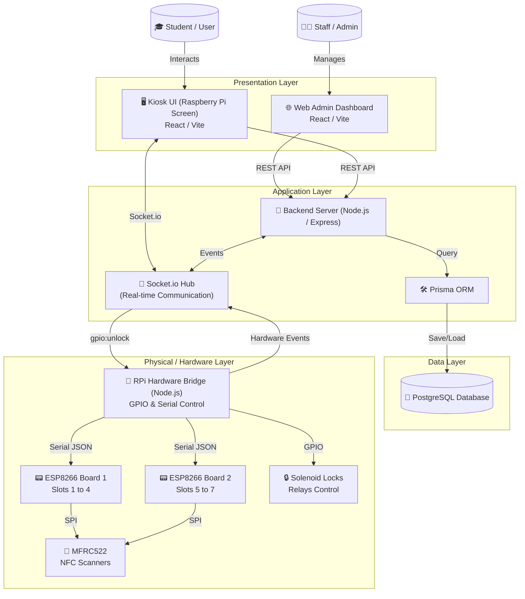

# KMS System Architecture Overview

This diagram shows the communication flow between the Frontend, Backend, Kiosk Hardware, and Database.

## Communication Protocols
1.  **REST API (HTTP)**: Used for major transactions like authentication, fetching key lists, and submitting borrow reasons.
2.  **Socket.io (WebSockets)**: Provides instantaneous feedback between the physical cabinet and the UI.
3.  **Serial (UART)**: Protocol between the Raspberry Pi and ESP8266 controllers.
4.  **Prisma (TCP/SQL)**: Database communication for persistence.
