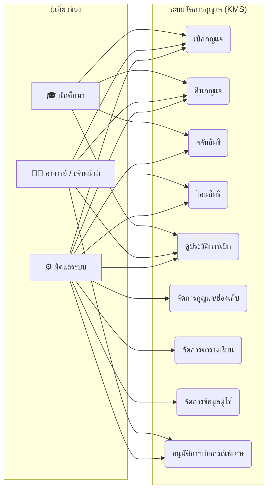
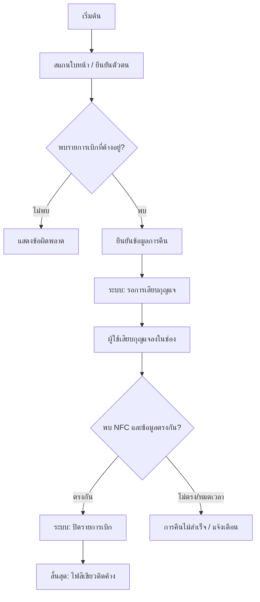
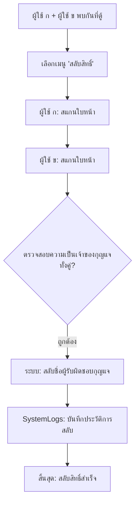
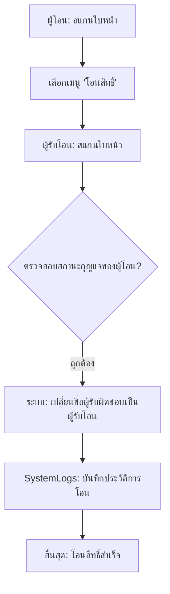

# KMS — แผนภาพขั้นตอนการดำเนินงาน (User Operation Diagrams)

เอกสารนี้รวบรวมแผนภาพ Use Case และลำดับการทำงาน (Flow) ต่างๆ ของระบบจัดการกุญแจ (KMS) ในรูปแบบภาษาไทย

---

## 1. Use Case Diagram (ภาพรวมบทบาทผู้ใช้งาน)



---

## 2. แผนภาพลำดับการทำงาน (Operation Flows)

### 2.1 ขั้นตอนการเบิกกุญแจ (Borrowing Flow)
```mermaid
flowchart TD
    A["เริ่มต้น"] --> B{"เลือกห้อง/กุญแจ"}
    B --> C["สแกนใบหน้า / ยืนยันตัวตน"]
    C --> D{"มีสิทธิ์ตามตาราง?"}
    D -- "ไม่มี" -- > E["ระบุเหตุผลการเบิกกรณีพิเศษ"]
    D -- "มี" --> F["ระบบ: สร้างรายการเบิก (Booking)"]
    E --> F
    F --> G["ฮาร์ดแวร์: ปลดล็อคกลอนไฟฟ้า"]
    G --> H["ผู้ใช้ออกกุญแจออกจากตู้"]
    H --> I["สิ้นสุด: ไฟสีเขียวติดค้าง"]
```

### 2.2 ขั้นตอนการคืนกุญแจ (Returning Flow)


### 2.3 ขั้นตอนการสลับสิทธิ์ (Swap Rights Flow)
*ใช้ในกรณีผู้ใช้ 2 คนต้องการแลกเปลี่ยนกุญแจที่ถืออยู่โดยไม่ต้องนำกุญแจมาคืนที่ตู้*


### 2.4 ขั้นตอนการโอนสิทธิ์ (Transfer Rights Flow)
*ใช้ในกรณีผู้มีชื่อเบิกต้องการโอนความรับผิดชอบกุญแจให้ผู้อื่น*

